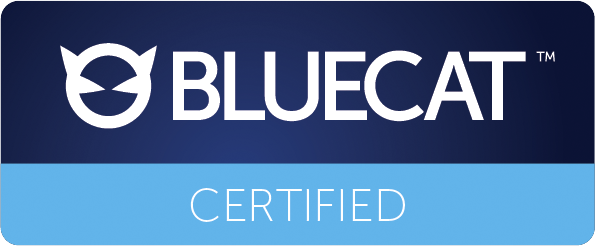

# **BlueCat Gateway**

## Certified Workflows

The Certified folder contains **Certified Workflows** developed and tested by BlueCat. These Certified Workflows demonstrate the kinds of workflows that can be built for BlueCat Gateway, as well as BlueCat's best practices for Python development, UI components, and API usage.

These Certified workflows will only work on Gateway versions 19.5.1 or greater

Each release of BlueCat Gateway has a corresponding tag that can be used to download the version that is guaranteed to be compatible with that release.
