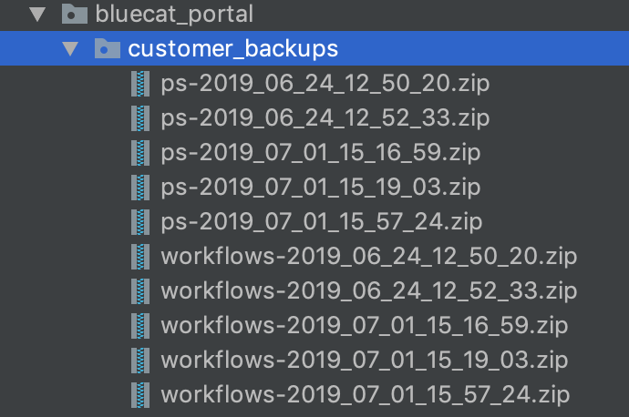
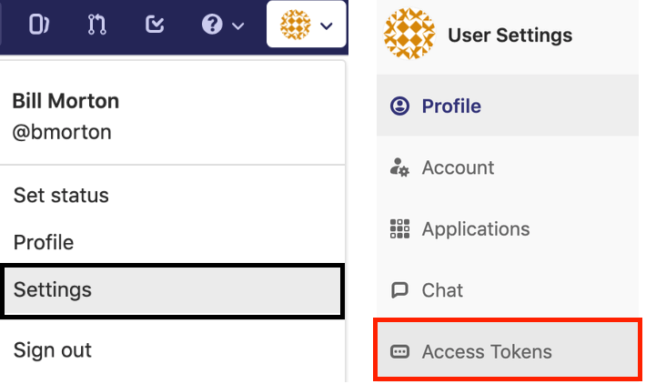
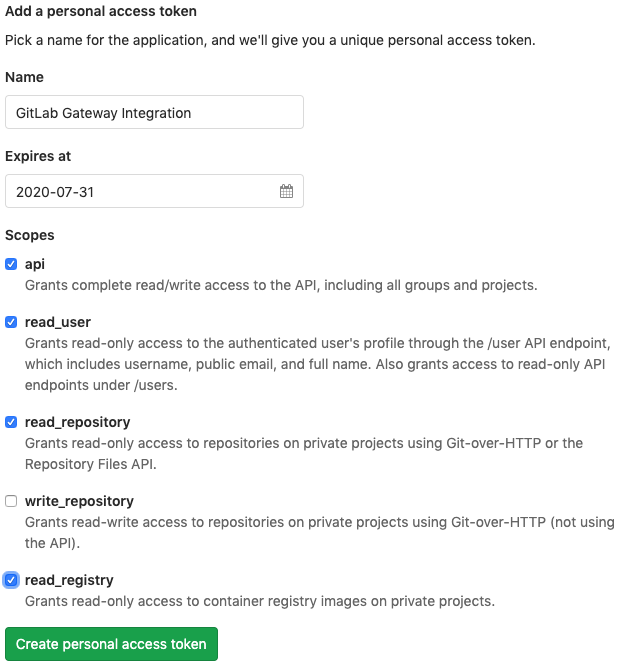
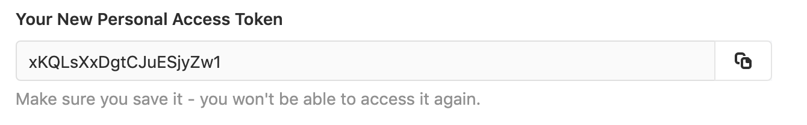
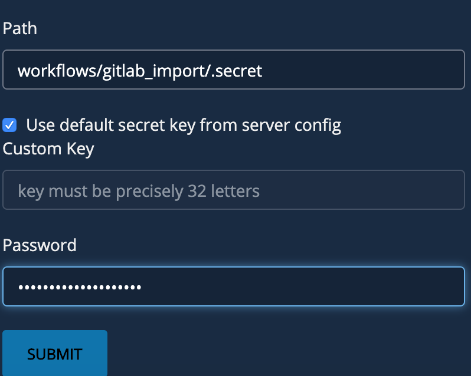
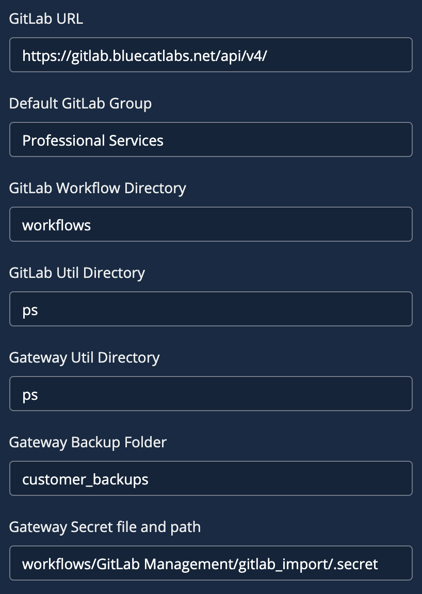

# **Community GitLab Configuration Integration Workflow**
This workflow applies to BlueCat customers who use GitLab internally for their repository management and want to promote code from a development environment to GitLab, to Production.

___

### Requirements
**BlueCat Gateway version:** 19.5.1 and greater  
**GitLab API version:** v4  
**Python 3rd party libraries:**  os, re, sys, importlib 

___

### Description/Example Usage
This GitLab Import workflow allows you to configure the GitLab Import Integration workflow. 

___

### Prerequisites

1.  Create backup folder on the Gateway server. This is where all the zip files will be moved to. Below is the backup format: 

  

2.  Create a personal token in GitLab. To do this, at the top left select your username and select "Settings". Then, on the left side menu, select "Access Tokens"

  

*  Enter the following data:

    * Token Name
    * Expire Date
    * Select the following Scopes
        * API
        * read_user
        * read_repository
        * read_registry

*  Click "Create personal access token"

  

   * The next window will show your token. You'll need to copy this and encrypt it in the next step below

  

3.  Encrypt the personal token and create a secret file by going to the workflow Administration > Encrypt Password

  

___

### Workflow Configuration

1.  Navigate to the workflow GitLab Management > GitLab Configuration and configure:
    * **GitLab URL** - This is the IP Address for your GitLab instance. 
    * **Default GitLab Group** - This will be the parent where your projects and subgroups are under
    * **GitLab Workflow Directory** - This is the folder where your workflow's are that you wish to import from GitLab
    * **GitLab Util Directory** - This is the folder where your util file is in GitLab. If you dont have a util file, leave blank
    * **Gateway Util Directory** - This is where the util dir lives on the Gateway server
    * **Gateway Backup Folder** - Folder where zip files will be when workflows and utils are downloaded
    * **Gateway Secret file and path** - This is the path to the encrypted password file

**NOTE:**

If you do not use a util file, then make sure that field is left blank.

  

___

<!--
### Youtube Tutorial

-->

___

### Known Errors and Bugs: 

1)  If you put workflow's in the folder Admin or Administration, the import/backups will not work properly. Please refrain from using these directories.

___

©2019 BlueCat Networks (USA) Inc. and its affiliates (collectively ‘ BlueCat’). All rights reserved.
This document contains BlueCat confidential and proprietary information and is intended only for the person(s) to whom it is transmitted.
Any reproduction of this document, in whole or in part, without the prior written consent of BlueCat is prohibited.