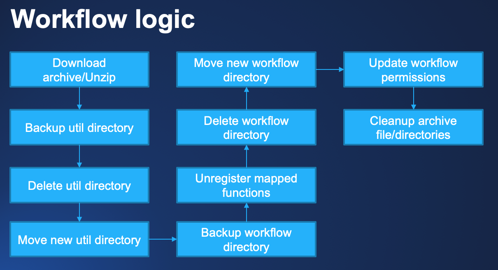
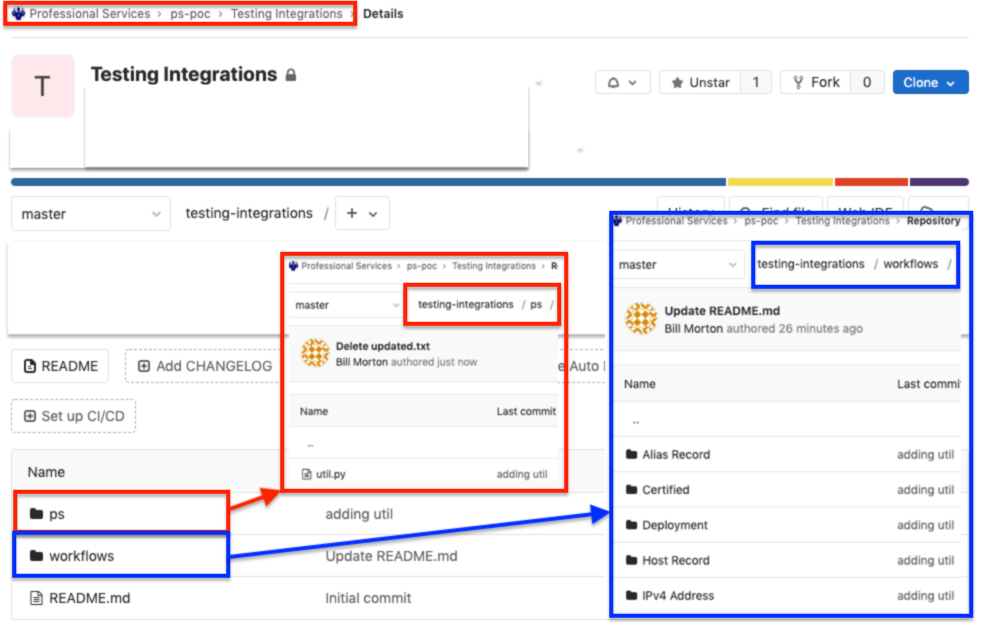

# **Community GitLab Integration Workflow**
This workflow applies to BlueCat customers who use GitLab internally for their repository management and want to promote code from a development environment to GitLab, to Production.

___

### Requirements
**BlueCat Gateway version:** 19.5.1 and greater  
**GitLab API version:** v4  
**Python 3rd party libraries:** io, os, re, shutil, sys, zipfile, datetime 

___

### Description/Example Usage
This GitLab Import workflow allows you to import all your workflow's and util file in a single click. 

Before importing, this will automatically backup your workflow's and util file to a defined folder on the Gateway server. Atfer completing the backup, Gateway will download the archive.zip file for the project selected. If there is a new workflow being added, you will need to update the permissions after importing. All other workflows assume the same permissions. 

Below is the logic:

 

  

 

___

### Prerequisites

1.  Run the GitLab Configuration workflow. This will set up the configurables for running this workflow. If you have not completed this workflow, you will have errors running the import!

___

### Example of GitLab setup:

  

The above image, in this workflow in Gateway, we would select "professional-services/ps-poc/Testing Integrations".

The GitLab Configuration workflow would have the following:

*  Default GitLab Group = 'Professional Services'
*  GitLab Workflow Directory = 'workflows'
*  GitLab Util Directory = 'ps'
*  Gateway Util Directory = 'ps'

The following would import the below into Gateway:

*  ps/util.py
*  workflow/Alias Record
*  workflow/Certified 
*  workflow/Deployment
*  workflow/Host Record
*  workflow/IPv4 Address

<!--
### Youtube Tutorial

-->

___

### Known Errors and Bugs: 

1)  If you put workflow's in the folder Admin or Administration, the import/backups will not work properly. Please refrain from using these directories.

___

©2020 BlueCat Networks (USA) Inc. and its affiliates (collectively ‘ BlueCat’). All rights reserved.
This document contains BlueCat confidential and proprietary information and is intended only for the person(s) to whom it is transmitted.
Any reproduction of this document, in whole or in part, without the prior written consent of BlueCat is prohibited.