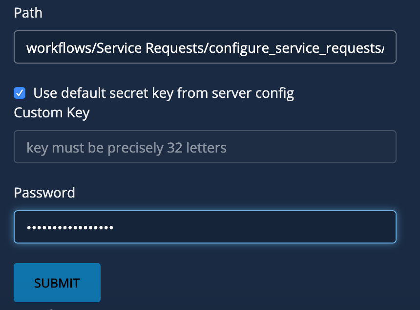
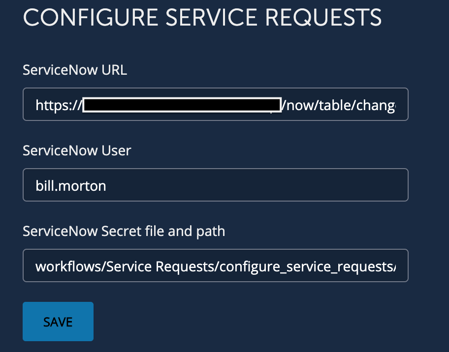

# **Community ServiceNow Configuration Workflow**
This will let you configure your ServiceNow values instead of manually updating a config file.

___

### Requirements
**BlueCat Gateway version:** 19.5.1 and greater  
**Python 3rd party libraries:**  os, re, sys, importlib 

___

### Description/Example Usage
This configure service request  workflow allows you to configure the ServiceNow request and manage requests workflow. 

___

### Prerequisites

1.  ServiceNow URL 

2.  ServiceNow User Name

3.  Encrypt the ServiceNow Password and create a secret file by going to the workflow Administration > Encrypt Password. The path and file used in the screenshot below is:

workflows/Service Requests/configure_service_requests/.secret

  

___

### Workflow Configuration

1.  Navigate to the workflow Service Requests > Configure Service Requests and configure:
    * **ServiceNow URL** - This is the IP Address/Hostname for your SNOW instance
    * **ServiceNow User** - This is the user name used to make REST calls
    * **ServiceNow Secret file and path** - This is the path to the encrypted password file

  

___

<!--
### Youtube Tutorial

-->

___

### Known Errors and Bugs: 

___

©2019 BlueCat Networks (USA) Inc. and its affiliates (collectively ‘ BlueCat’). All rights reserved.
This document contains BlueCat confidential and proprietary information and is intended only for the person(s) to whom it is transmitted.
Any reproduction of this document, in whole or in part, without the prior written consent of BlueCat is prohibited.
