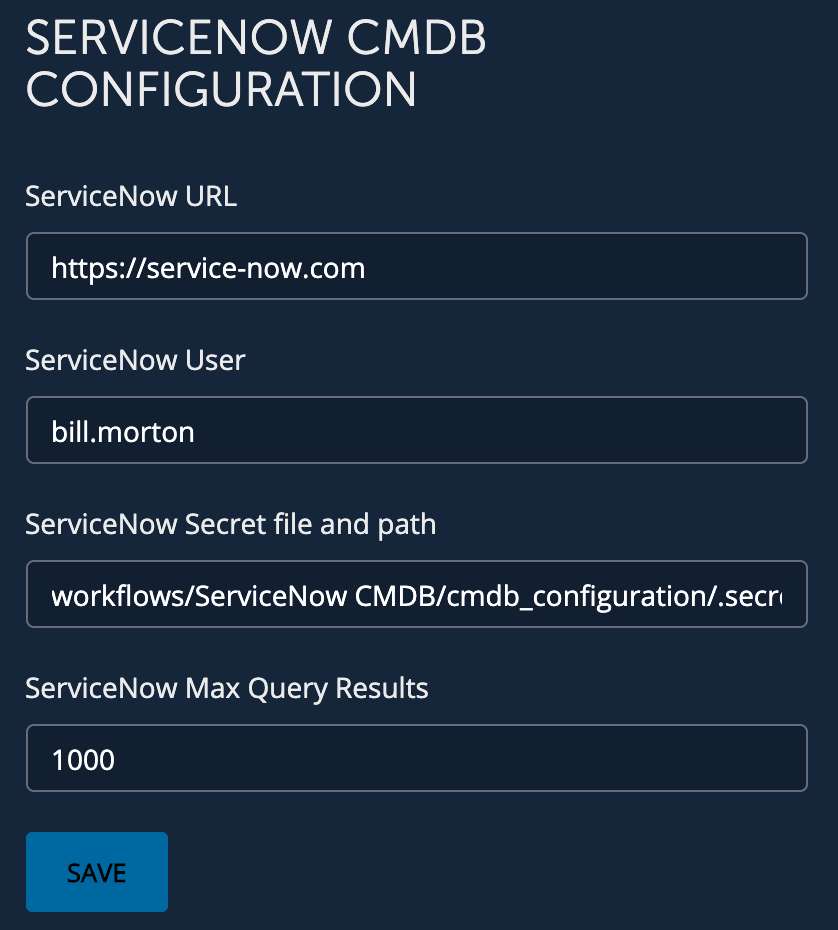

# **Community: ServiceNow CMDB Configuration**
This is used to configure values used in all workflow's in ServiceNow folder in GitHub.

___

### Requirements
**BlueCat Gateway version:** 19.8.1 and greater  
**Address Manager version:** v9.0.0 or greater  
**Address Manager:**  Configuration of the Gateway server IP address in the BAM Administration Console. For more information, refer to the section Adding host access to the database in the Address Manager Administration Guide  
**ServiceNow: version:** wed  

___

### Description/Example Usage
This allows you to configure the ServiceNow CMDB values instead of hard coding values. 

___

### Workflow Configuration

1.  Navigate to the workflow CMDB Management > CMDB Configuration and configure:
    * **ServiceNow URL** - Your ServiceNow URL
    * **ServiceNow User** - The ServiceNow user account used to login as
    * **ServiceNow Secret File and Path** - This is the path and file to the encrypted users password
    * **ServiceNow Max Query results** - If the workflow's URL is configured to use this config, this will be the max results retured 

  

___

### Known Errors and Bugs: 

None

___

©2019 BlueCat Networks (USA) Inc. and its affiliates (collectively ‘ BlueCat’). All rights reserved.
This document contains BlueCat confidential and proprietary information and is intended only for the person(s) to whom it is transmitted.
Any reproduction of this document, in whole or in part, without the prior written consent of BlueCat is prohibited.
