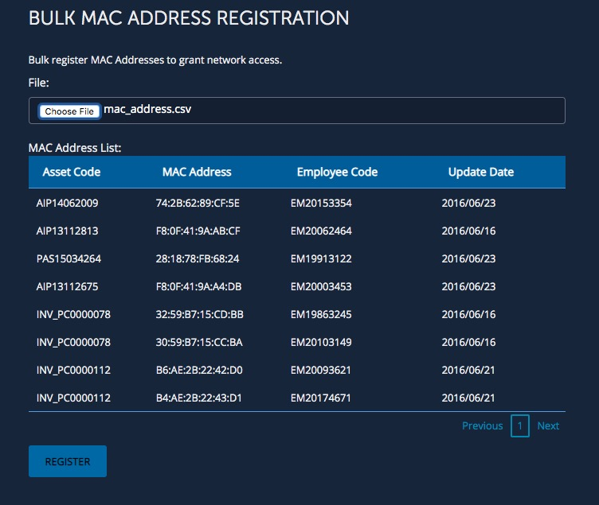

# Bulk MAC Address Registration  
**Bluecat Gateway Version:** 18.10.2 and greater  
**BAM Version:** 9.0.0 and greater  

This workflow will add MAC Addresses in bulk from a CSV file.  

## Prerequisites
1. **BAM Default Configuration**  
This workflow will be using the default configuration value in `/portal/bluecat_portal/config.py` in BlueCat Gateway container.  To set the default configuration, in BlueCat Gateway, go to Administration > Configurations > General Configuration.  
In General Configuration, select the BAM Settings tab and enter the configuration name under "Default Configuration:" and save.  
  

2. **UDF**  
This workflow requires the following UDF.  
Add the following UDF to MAC Pool Objects > MAC Address object in BAM.  
  - Comments  
  Field Name: Comments    
  Display Name: Comments   
  Type: Text  
  
1. **Python3 scp module**  
This workflow requires the python scp module.  
Install scp module using PIP3 inside the BlueCat Gateway container.
```
$pip3 install scp

```

## Usage  

1. **Create a CSV file**  
Create a CSV file which has "Asset Code", "MAC Address", "MAC Pool", and "Comments" data.  
For example:   
```
Asset Code,MAC Address,MAC Pool,Comments
AIP14062009,74:2B:62:89:CF:5E,ITLAB-MAC-Pool,Demo MAC address 1
AIP13112813,F8:0F:41:9A:AB:CF,ITLAB-MAC-Pool,Demo MAC address 2
PAS15034264,28:18:78:FB:68:24,ITLAB-MAC-Pool,Demo MAC address 3
AIP13112675,F8:0F:41:9A:A4:DB,ITLAB-MAC-Pool,Demo MAC address 4
INV_PC0000078,32:59:B7:15:CD:BB,ITLAB-MAC-Pool,Demo MAC address 5
INV_PC0000078,30:59:B7:15:CC:BA,ITLAB-MAC-Pool,Demo MAC address 6
INV_PC0000112,B6:AE:2B:22:42:D0,ITLAB-MAC-Pool,Demo MAC address 7
INV_PC0000112,B4:AE:2B:22:43:D1,ITLAB-MAC-Pool,Demo MAC address 8

```
2. **Import CSV file in BlueCat Gateway**  
Click "Choose File" and select the corresponding CSV file.  
The Group List will be populated as below:  
     
<!--    -->

3. **Add users to BAM**  
Click "REGISTER".  
  

4. **Check BAM to see results**  

---

## Additional  

1. **Language**  
You can switch to a Japanese menu by doing the following.  
    1. Create *ja.txt* in the BlueCat Gateway container.  
    ```
    cd /portal/Administration/create_workflow/text/  
    cp en.txt ja.txt  
    ```  
    2. In the BlueCat Gateway web UI, go to Administration > Configurations > General Configuration.   
    In General Configuration, select the *Customization* tab.  
    Under *Language:* type in `ja` and save.  
      

2. **Appearance**  
This will make the base html menus a little bit wider.  
    1. Copy all files under the directory `additional/templates` to `/portal/templates` inside the Bluecat Gateway container.  

## Author   
- Akira Goto (agoto@bluecatnetworks.com)  
- Ryu Tamura (rtamura@bluecatnetworks.com)  

## License
©2020 BlueCat Networks (USA) Inc. and its affiliates (collectively ‘ BlueCat’). All rights reserved. This document contains BlueCat confidential and proprietary information and is intended only for the person(s) to whom it is transmitted. Any reproduction of this document, in whole or in part, without the prior written consent of BlueCat is prohibited.
