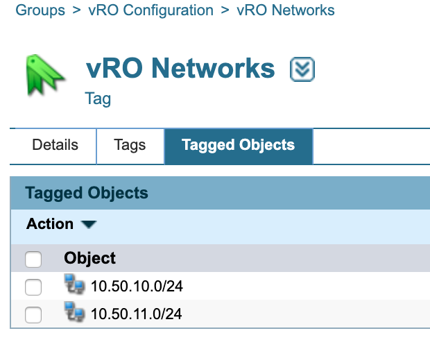

# **Community: Create Server - vRO User Group Content**
This workflow was used in the 2020 User Groups to show creating a hostname and getting the next available IP Address.
___

### Requirements
**BlueCat Gateway version:** 19.8.1 and greater  
**Address Manager version:** v9.0.0 or greater  
**Address Manager:**  Configuration of the Gateway server IP address in the BAM Administration Console. For more information, refer to the section Adding host access to the database in the Address Manager Administration Guide  

___

### Description/Example Usage
This Gateway workflow will create a host record and assign the next available IP Address based on the Networks that are linked to the Tag Group:

___

### Workflow Configuration

1.  Create the following in Address Manager:
    * **Tag Group > vRO Configuration** - This is the base tag group. 
    * **Tag > vRO Networks** - This is the tag used to get the networks
    * **Tag Networks** - The networks used to get next available IP

 

  

<!--
### Youtube Tutorial

-->

___

### Known Errors and Bugs: 

1)  If you put workflow's in the folder Admin or Administration, the import/backups will not work properly. Please refrain from using these directories.

___

©2019 BlueCat Networks (USA) Inc. and its affiliates (collectively ‘ BlueCat’). All rights reserved.
This document contains BlueCat confidential and proprietary information and is intended only for the person(s) to whom it is transmitted.
Any reproduction of this document, in whole or in part, without the prior written consent of BlueCat is prohibited.

vRO Configuration > vRO Networks