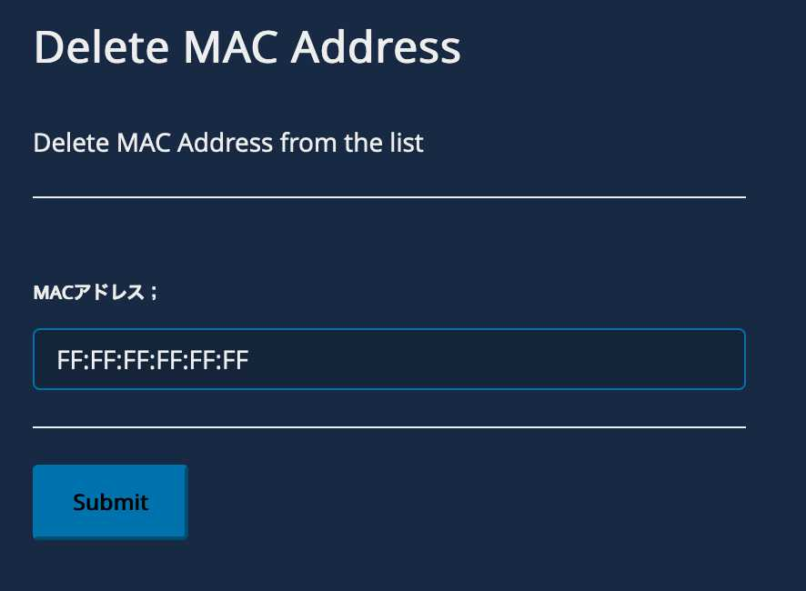

# Delete MAC Address  
**Bluecat Gateway Version:** 18.10.2 and greater  
**BAM Version:** 9.0.0 and greater  

This workflow will delete specific MAC address registered.   
If the MAC address is associated to IP Address, it will not delete it and shows the message.

## Prerequisites
1. **BAM Default Configuration**  
This workflow will be using the default configuration value in `/portal/bluecat_portal/config.py` in BlueCat Gateway container.  To set the default configuration, in BlueCat Gateway, go to Administration > Configurations > General Configuration.  
In General Configuration, select the BAM Settings tab and enter the configuration name under "Default Configuration:" and save.  
  


## Usage   

1. **Delete MAC Address**  
   
<!--    -->

Enter the following information:  

- *MAC Address*  
Enter the MAC Address you wish to delete.  
Either separators (Dash or Colon) can be used.  
This field is mandatory.    

Click *SUBMIT*  
  
Check the message shows MAC address is deleted.  
 
   
 Check the message including IP address associated to the MAC address.
 
---

## Additional  

1. **Language**  
You can switch to a Japanese menu by doing the following.  
    1. Create *ja.txt* in the BlueCat Gateway container.  
    ```
    cd /portal/Administration/create_workflow/text/  
    cp en.txt ja.txt  
    ```  
    2. In the BlueCat Gateway web UI, go to Administration > Configurations > General Configuration.   
    In General Configuration, select the *Customization* tab.  
    Under *Language:* type in `ja` and save.  
      


## Author    
- Akira Goto (agoto@bluecatnetworks.com)  
- Ryu Tamura (rtamura@bluecatnetworks.com)    
- Kentaro Mori (kmori@bluecatnetoworks.com)

## License
©2021 BlueCat Networks (USA) Inc. and its affiliates (collectively ‘ BlueCat’). All rights reserved. This document contains BlueCat confidential and proprietary information and is intended only for the person(s) to whom it is transmitted. Any reproduction of this document, in whole or in part, without the prior written consent of BlueCat is prohibited.