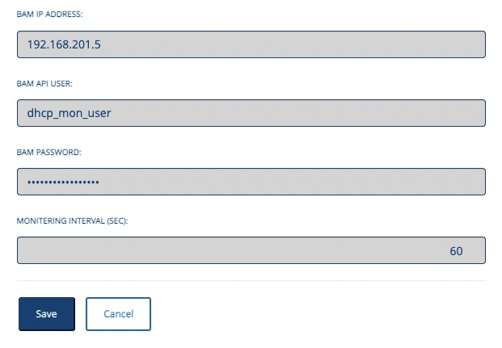
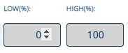
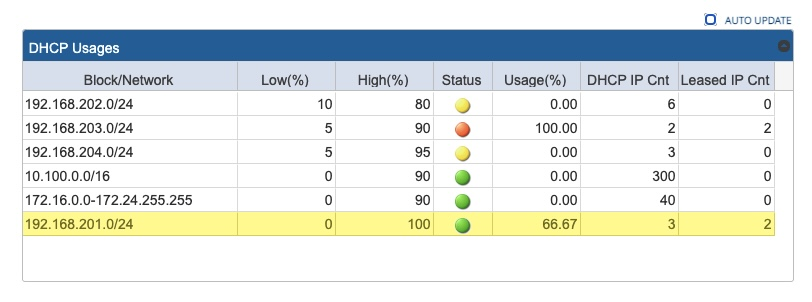
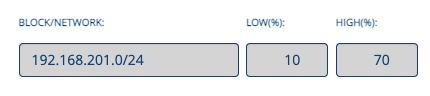
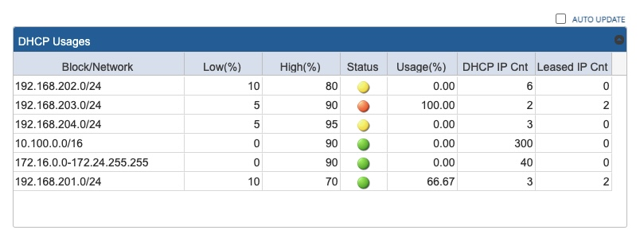
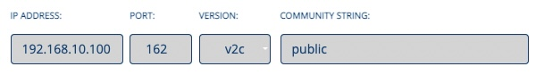
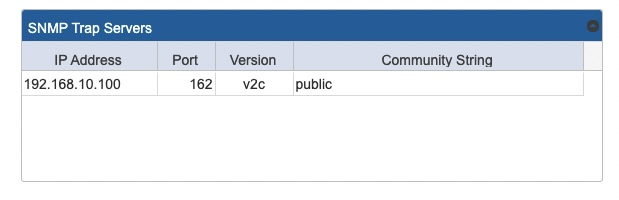

# DHCP Usage Monitor

**Bluecat Gateway Version:** 22.4.1 and greater  
**BAM Version:** 9.4.0 and greater

This workflow will retrieve specified block / network information from BAM and monitor / show the overall DHCP usage within that specified block / network. A typical use case of this workflow would be when you need to monitor the overall usage of DHCP either within a large block where many networks exists or within a network with multiple DHCP ranges.

## Prerequisites

1. **BAM Default Configuration**  
   This workflow will be using the default configuration value in `/portal/bluecat_portal/config.py` in BlueCat Gateway container. To set the default configuration, in BlueCat Gateway, go to Administration > Configurations > General Configuration.  
   In General Configuration, select the BAM Settings tab and enter the configuration name under "Default Configuration:" and save.  
   

2. **BAM Access Configuration**  
   This workflow will access the BAM database via SQL.  
   In order to gain access to BAM you must first configure the BAM database settings to allow access the BlueCat Gateway IP address.  
   Refer to the BAM Administration Guide for more details.

3. **Additional Python3 packages**  
   This workflow requires the following additional python3 packages.

   > _psycopg2_, _pytz_, _apscheduler_, _pysnmp_

   Install additional packages using PIP3 inside the BlueCat Gateway container.

   ```
   $pip3 install psycopg2 pytz apscheduler pysnmp
   ```

4. **jqGrid**  
   This workflow requires jqGrid.  
   Download jqGrid from [HERE](http://www.trirand.com/blog/?page_id=6).  
   After downloading, extract the following three files: _"ui.jqgrid.css"_, _"jquery.jqGrid.min.js"_ and _"grid.locale-xx.js"_.  
   _"grid.locale-xx.js"_ will change depending on the locale you choose to use.  
   (For instance, for Japan it will be _"grid.locale-ja.js"_)  
   Copy _"ui.jqgrid.css"_ and _"jquery.jqGrid.min.js"_ under `/portal/static/js/vendor/jqgrid/` inside the Bluecat Gateway container.  
   Create a new directory `jqgrid` under `/portal/static/js/vendor/` if none exists.  
   Copy _"grid.locale-xx.js"_ under `/portal/static/js/vendor/jqgrid/i18n/` inside the Bluecat Gateway container.  
   Create a new directory `i18n` under `/portal/static/js/vendor/jqgrid` if none exists.

5. **BAM user**  
   This workflow requires a BAM user with the following credentials.

   > BlueCat Gateway UDF: all  
   > User Type: Administrator  
   > User Access Type: GUI and API

   Create a user in BAM if not created.  
   Refer to the BAM Administration Guide for more details.

## Setting It Up

1. **Setting BAM User**  
   Click the `BAM Settings` menu on the top.  
   Populate each item.  
   Information for each item is the following:

   > _BAM IP ADDRESS_: IP address of BAM  
   > _BAM API USER_: Unique user name in BAM  
   > _BAM PASSWORD_: Password for the user  
   > _MONITORING INTERVAL(SEC)_: The interval of monitoring the DHCP usage (in seconds). The default value is 60

     
   Click `Save` and save configutation.

## Usage

1. **Select a block or a network**  
   Enter the block / network to add to the list.  
     
   Type in the full detail or start typing and select from one of the appearing candidates.  
   Blocks can take in either a CIDR format or a range format.  
   Networks can only take in CIDR format.  
   Only existing blocks / networks in BAM are able to be added.

     
   Then choose the overall low and high watermarks for that block / network.

   Click `Add` to add the selected block / network to the list.  
   Repeat the process to add multiple blocks / networks to the list.

2. **Save monitor configuration**  
   Once you have added blocks / networks to the list, you can save the configured list by clicking `Save`.  
   Information on each column are the following.  
   

   - Block/Network  
     The specified block / network to monitor overall DHCP usage.

   - Low (%)  
     The specified low watermark percentage.
   - High (%)  
     The specified high watermark percentage.
   - Status  
     Status of DHCP usage.  
     A green circle  will be shown when the DHCP usage is within the specified low and high watermarks.  
     A yellow circle  will be shown when the DHCP usage is lower than the specified low watermark.  
     A red circle  will be shown when the DHCP usage has exceeded the specified high watermark.
   - Usage (%)  
     The overall usage within the specified block / network in percentage.
   - DHCP IP Cnt  
     The overall number of DHCP IP addresses within the specified block / network.
   - Leased IP Cnt  
     The overall number of DHCP IP addresses which are currently leased within the specified block / network.

   Checking the `AUTO UPDATE` check box will automatically refresh the list every 10 seconds.  
    

3. **Updating the watermark**  
   If you wish to update the watermark of an existing block / network in the list,

   1. Click the existing block / network in the list and highlight.  
      
   2. Update the watermark percentage.  
      
   3. Click `Update` and check that the list has been updated.
   4. Save the new watermark by clicking `Save`.  
      

4. **Add blocks / networks from a CSV file**  
   If there are many blocks / networks to add, there is an option to add them via CSV file.

   1. Create a CSV file which has "Block/Networks", "Low Watermark (percentage)" and "High Waterwark (percentage)" data.  
      For example:

      ```csv
      block/network,low_watermark,high_watermark
      192.168.4.0/24,0,95
      192.168.5.0/24,0,95
      192.168.6.0/24,0,95
      192.168.7.0/24,0,95
      ```

   2. Click `Choose File` and select the corresponding CSV file.  
      The list will be populated with data from the files.
   3. Click `Save` to save the configuration.

5. **SNMP Trap**  
   A SNMP trap can be set to trigger once the usage either goes lower or higher than the specified watermark.

   1. Click the `SNMP Trap Settings` menu on the top.
   2. Populate each item.  
        
      Information on each items are the following.

      - IP Address:
        IP Address of the SNMP trap server.
      - Port:
        Port number of the SNMP trap server.
      - Version:  
        SNMP version for the SNMP trap server from the drop-down menu: either v1 or v2c.
      - Community String:  
         The SNMP community string. This string is used to validate the trap server registering to receive traps.

      Click `Add` to add the trap server information to the `SNMP Trap Servers` list.  
         
       Repeat process if you have multiple trap servers to set.

   3. Save configuration  
      Click `Save` and save current configuration.

---

## Additional

1. **Language**  
   You can switch to a Japanese menu by doing the following.

   - In the BlueCat Gateway web UI, go to Administration > Configurations > General Configuration.  
      In General Configuration, select the _Customization_ tab.  
      Under _Language:_ type in `ja` and save.  
      

## Author

- Akira Goto (agoto@bluecatnetworks.com)
- Ryu Tamura (rtamura@bluecatnetworks.com)

## License

©2022 BlueCat Networks (USA) Inc. and its affiliates (collectively ‘ BlueCat’). All rights reserved. This document contains BlueCat confidential and proprietary information and is intended only for the person(s) to whom it is transmitted. Any reproduction of this document, in whole or in part, without the prior written consent of BlueCat is prohibited.
