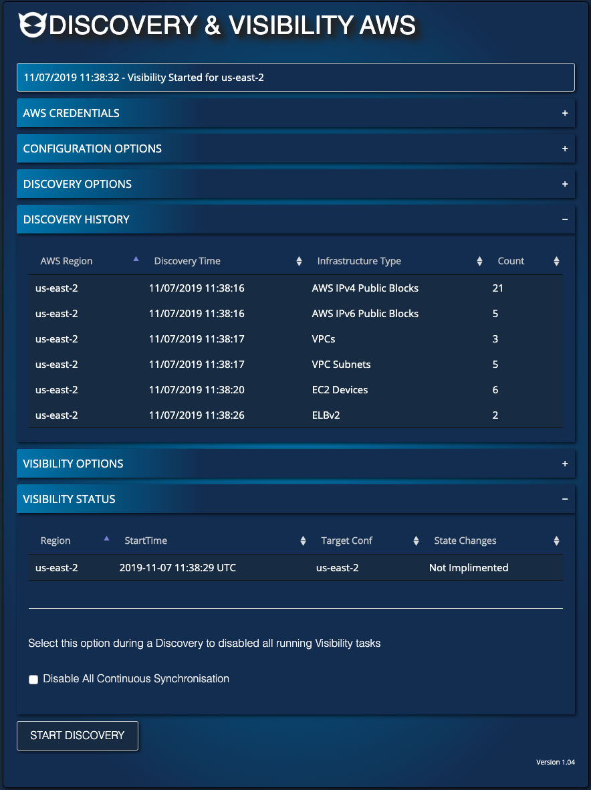
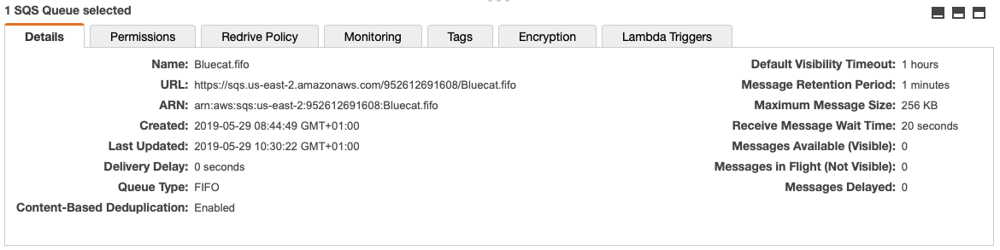
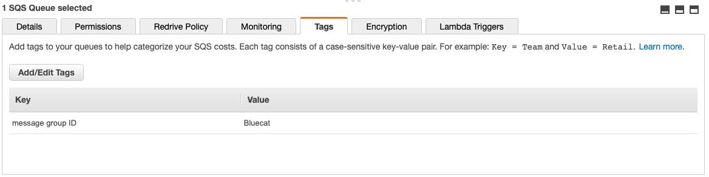
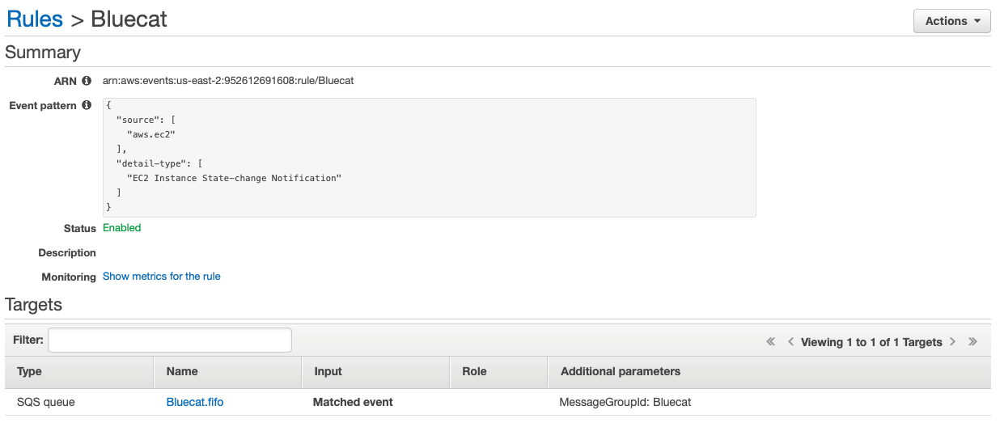

# Cloud Discovery and Visibility - AWS

**NOTE :- This is a community supported technology preview, it should be used with caution in production environments until a planned certified release is made available by BlueCat**

# Capabilities

- Discovery of AWS VPCs/Subnets/EC2 Instances/Route53 Zone/ELBv2 resources into BlueCat Adaptive DNS
- Provides near-realtime updates to state changes in EC2 using Continuous Synchronisation
- Automatically builds Amazon DNS (EC2 DNS records) into DNS View Amazon External DNS
- Automatically can create a new target domain using EC2 name tags into DNS View Amazon External DNS
- Automatically documents Route53 Public and Private Hosted Zones into BlueCat DNS views
- Can dynamically update authoritative BlueCat DNS using Selective Deployment

# Release Requirements
- BlueCat Address Manager 9.1+
- Gateway 19.5.1+

# Configuring Discovery & Visibility - AWS

- Download CloudDiscovery_AWS_X.X.X.tar.gz or sourcefiles
- Install the required python libraries into BlueCat Gateway:

```
sudo docker exec bluecat_gateway pip install boto3 —-user
sudo docker exec bluecat_gateway pip install netaddr —-user
sudo docker exec bluecat_gateway pip install apscheduler —-user
docker restart bluecat_gateway
```

- Import CloudDiscovery_AWS_X.X.X.tar.gz into BlueCat Gateway
or
- Install sourcefiles into your DATA location and restart BlueCat Gateway
- Add workflow permissions to CloudAtlas/aws > aws_page.py

# Screen Shot




# Advanced - Manually configuring SQS/CloudWatch Rules

If the AWS user has write permissions to SQS and Cloudwatch then the Enable Visibility after Discovery Option will attempt to create the queue and rule if they don't exist.

If this fails due to the account not having write permissions to those services, please have the administrator configure the AWS SQS FIFO queue and CloudWatch Rule as below

- Create a FIFO SQS queue in your AWS region, called Bluecat.fifo



- Add a message group ID of Bluecat to the SQS queue



- Add a AWS CloudWatch Rule called Bluecat for EC2 event changes which points to the BlueCat SQS FIFO queue




<!-- Copyright 2020 BlueCat Networks. All rights reserved. -->

©2020 BlueCat Networks (USA) Inc. and its affiliates (collectively ‘ BlueCat’). All rights reserved. This document contains BlueCat confidential and proprietary information and is intended only for the person(s) to whom it is transmitted. Any reproduction of this document, in whole or in part, without the prior written consent of BlueCat is prohibited.

Workflow Version: 1.0.7 <br/>
Project Title: Discovery and Visibility - AWS <br/>
Author: B.Shorland <br/>
Date: 13-11-2019 <br/>
BlueCat Gateway Version: 19.5.1+ <br/>
BAM / BDDS Version: 9.1 <br/>
Dependencies: See requirements.txt<br/>
Installation Directions: See Above section of readme.md <br/>
