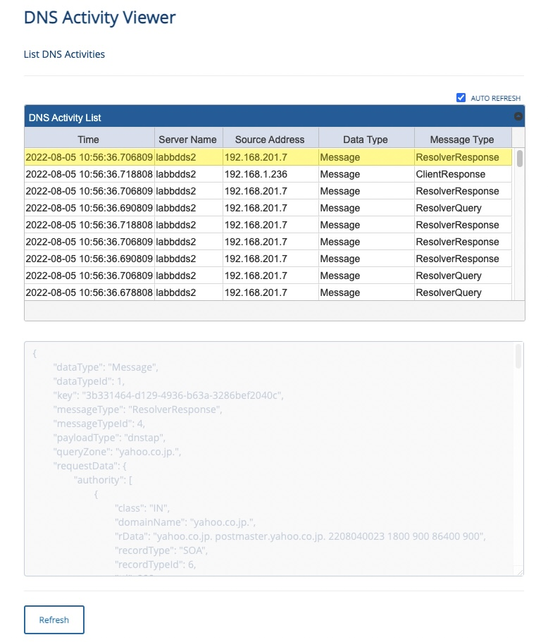
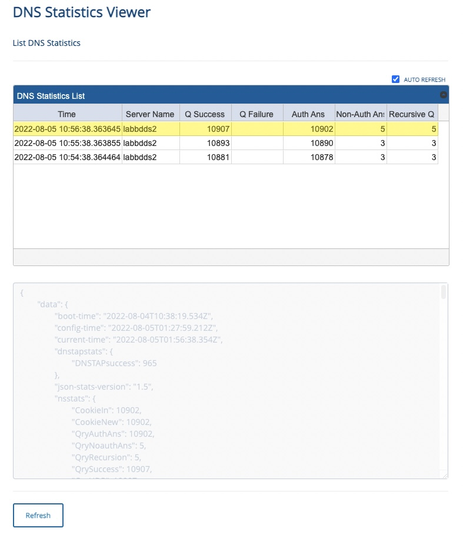
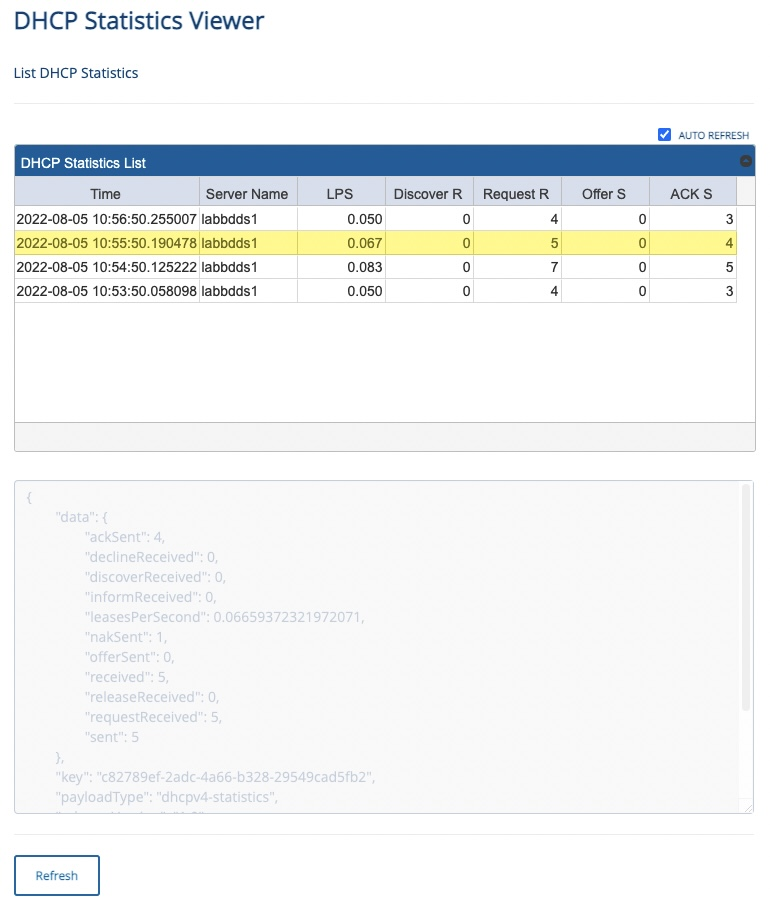

# Health Telemetries

**Bluecat Gateway Version:** 22.4.1 and greater  
**BAM Version:** 9.4.0 and greater

This set of workflows takes advantage of the new health telemetries feature offered from Integrity version 9.4.0. It is comprised of four individual workflows.

- [**Health Telemetries**](./health_telemetries/)  
  This workflow is an API only workflow.  
  It acquires the health telemetry data from BDDS and stores them, in other words this workflow acts as the HTTP endpoint for all health telemetry data.

- [**DNS Activity Viewer**](./dns_activity_viewer/)  
  This workflow will fetch DNS activity telemetry data from the _Health Telemetires_ workflow and list recent events in the GUI.

- [**DNS Statistics Viewer**](./dns_statistics_viewer/)  
  This workflow will fetch DNS statistics telemetry data from the _Health Telemetries_ workflow and list recent events in the GUI.

- [**DHCP Statistics Viewer**](./dhcp_statistics_viewer/)  
  This workflow will fetch DHCP statistics telemetry data from the _Health Telemetries_ workflow and list recent events in the GUI.

The purpose of these set of workflows are to quickly ascertain what kind of data are sent by the health telemetry service. The accumilated data is stored in memory plus the log files that are created by the workflow. This is obviously finite and is not by any means the best way to store data for a longer period of time. Alternative ways to store data or the use of SIEM tools such as Splunk is recommended for proper use of the health telemetry data.

## Prerequisites

1. **jqGrid**  
   The viewer workflows (DNS Activity Viewer / DNS Statistics Viewer / DHCP Statistics Viewer) require jqGrid.  
   Download jqGrid from [HERE](http://www.trirand.com/blog/?page_id=6).  
   After downloading, extract the following three files: _"ui.jqgrid.css"_, _"jquery.jqGrid.min.js"_ and _"grid.locale-xx.js"_.  
   _"grid.locale-xx.js"_ will change depending on the locale you choose to use.  
   (For instance, for Japan it will be _"grid.locale-ja.js"_)  
   Copy _"ui.jqgrid.css"_ and _"jquery.jqGrid.min.js"_ under `/portal/static/js/vendor/jqgrid/` inside the Bluecat Gateway container.  
   Create a new directory `jqgrid` under `/portal/static/js/vendor/` if none exists.  
   Copy _"grid.locale-xx.js"_ under `/portal/static/js/vendor/jqgrid/i18n/` inside the Bluecat Gateway container.  
   Create a new directory `i18n` under `/portal/static/js/vendor/jqgrid` if none exists.

## Setting It Up

In order for this set of workflows to work, the health statistics service on BDDS must be enabled. Instructions are below.

1. **Import workflows**  
   Import the _Health Telemetries_ workflow as this will be the HTTP endpoint for all health telemetry related data from BDDS.  
   Import other viewer workflows as well according to your needs.

2. **Set up and enable health telemetries feature on BDDS**  
   Refer to the _BlueCat Address Manager Administration Guide_ on how to set up and enable health telemtry services.  
   When setting up a service, make sure to choose the _OUTPUT TYPE_ to **HTTP**.  
   Enter the following for the _OUTPUT URI_ depeding on the service.  
   For DNS Activity service
   ```
   http://{Gateway-IP}/api/v1/health_telemetries/dns_activities
   ```
   For DNS Statistics service
   ```
   http://{Gateway-IP}/api/v1/health_telemetries/dns_statistics
   ```
   For DHCP Statistics service
   ```
   http://{Gateway-IP}/api/v1/health_telemetries/dhcp_statistics
   ```
   {Gateway-IP} is the IP address of the BlueCat Gateway server.

## Usage

- **DNS Activity Viewer**  
    
  Recent DNS activity will be shown on the _DNS Activity List_.  
  Five prominent data (columns) will be shown on the list for visibility.

  > **Time**: Time of the query  
  > **Server Name**: Name of the BDDS  
  > **Source Address**: Source Address of the query  
  > **Data Type**: Data Type of the query  
  > **Message Type**: Message Type of the query

  You can click and highlight a certain row.  
  Once highlighted, in the bottom section, a more detailed data will be shown in a JSON format.

  By hitting the `Refresh` button, the list will refresh.  
  By checking the `Auto Refresh` box, the list will auto refresh every 5 seconds.

- **DNS Statistics Viewer**  
    
  Recent DNS statistics will be shown on the _DNS Statistics List_.  
  Seven prominent data (columns) will be shown on the list for visibility.

  > **Time**: Time of the statistic data.  
  > **Server Name**: Name of the BDDS.  
  > **Q Success**: Number of success queries. This number is cumulative.  
  > **Q Failure**: Number of failed queries. This number is cumulative.  
  > **Auth Ans**: Number of autoritative answers. This number is cumulative.  
  > **Non-Auth Ans**: Number of non-authoritative answers. This number is cumulative.  
  > **Recurive Q**: Number of recursive queries. This number is cumulative.

  You can highlight a certain row.  
  Once highlighted, in the bottom section, a more detailed data will be shown in a JSON format.

  By hitting the `Refresh` button, the list will refresh.  
  By checking the `Auto Refresh` box, the list will auto refresh every 5 seconds.

- **DHCP Statistics Viewer**  
    
  Recent DHCP statistics will be shown on the _DHCP Statistics List_.  
  Seven prominent data (columns) will be shown on the list for visibility.

  > **Time**: Time of the statistic data.  
  > **Server Name**: Name of the BDDS.  
  > **LPS**: Number of lease per seconds.  
  > **Discover R**: Number of received DHCP discover packets.  
  > **Request R**: Number of received DHCP request packets.  
  > **Offer S**: Number of sent DHCP offer packets.  
  > **ACK S**: Number of sent DHCP ack packets.

  You can highlight a certain row.  
  Once highlighted, in the bottom section, a more detailed data will be shown in a JSON format.

  By hitting the `Refresh` button, the list will refresh.  
  By checking the `Auto Refresh` box, the list will auto refresh every 5 seconds.

---

## Additional

1. **Language**  
   You can switch to a Japanese menu by doing the following.

   - In the BlueCat Gateway web UI, go to Administration > Configurations > General Configuration.  
      In General Configuration, select the _Customization_ tab.  
      Under _Language:_ type in `ja` and save.  
      

## Author

- Akira Goto (agoto@bluecatnetworks.com)
- Ryu Tamura (rtamura@bluecatnetworks.com)

## License

©2022 BlueCat Networks (USA) Inc. and its affiliates (collectively ‘ BlueCat’). All rights reserved. This document contains BlueCat confidential and proprietary information and is intended only for the person(s) to whom it is transmitted. Any reproduction of this document, in whole or in part, without the prior written consent of BlueCat is prohibited.
