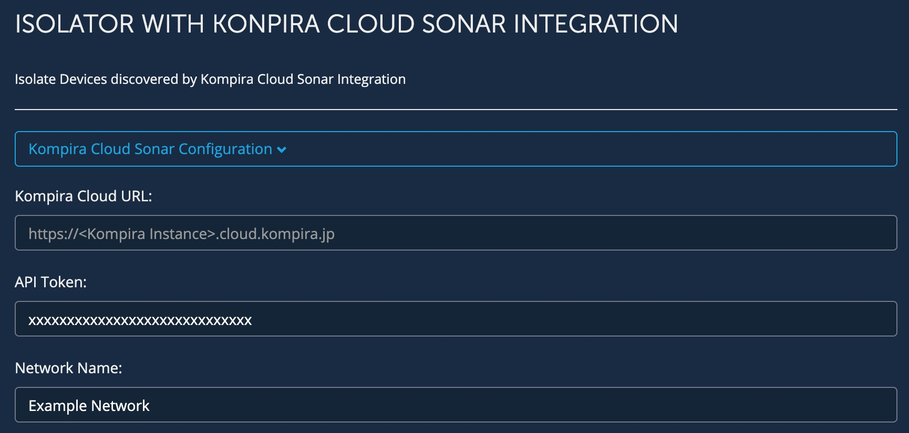
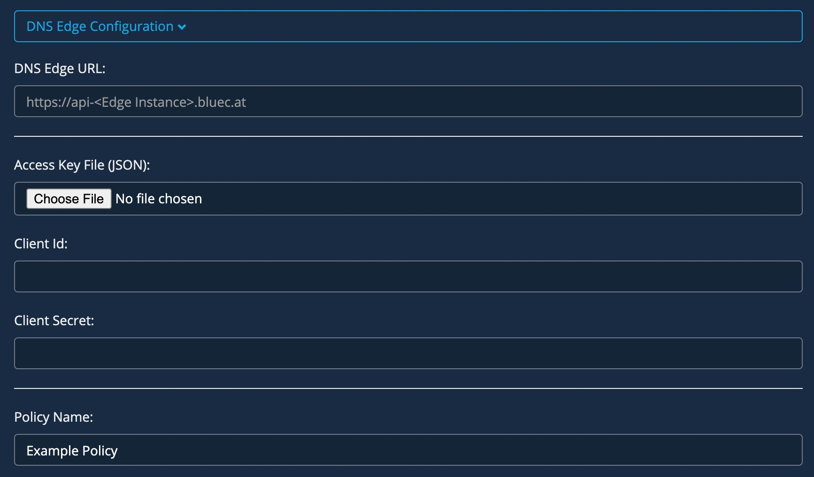
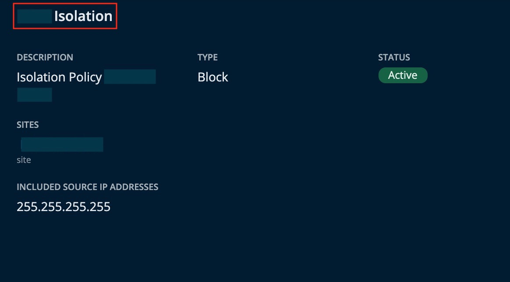
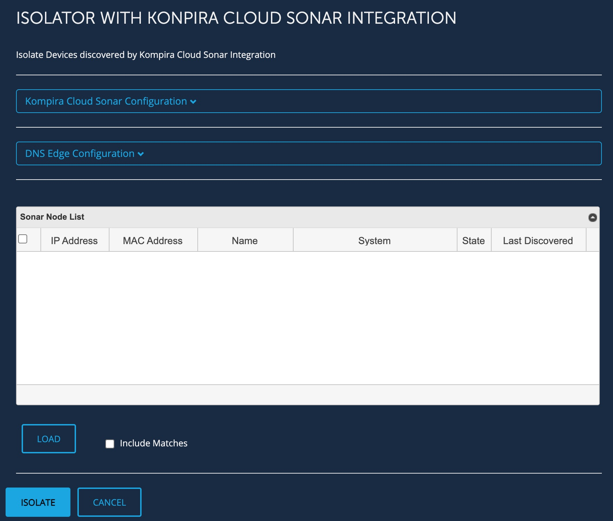
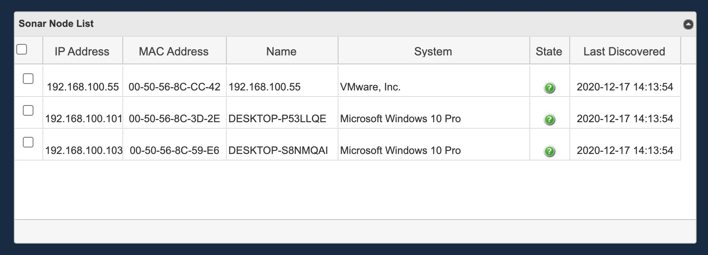
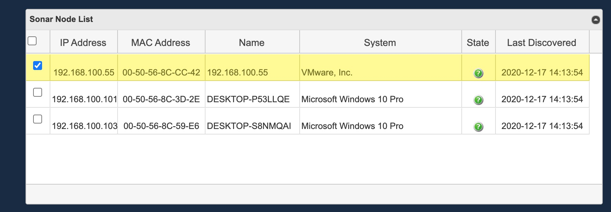
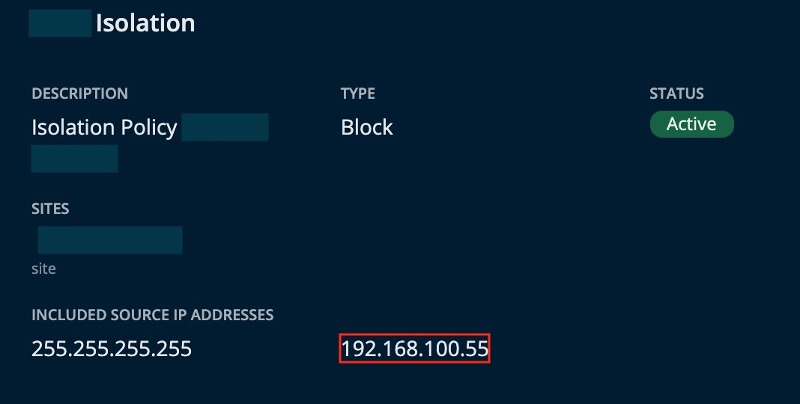

<!--  Copyright 2020 BlueCat Networks (USA) Inc. and its affiliates
 -*- coding: utf-8 -*-

 Licensed under the Apache License, Version 2.0 (the "License");
 you may not use this file except in compliance with the License.
 You may obtain a copy of the License at

 http://www.apache.org/licenses/LICENSE-2.0

Unless required by applicable law or agreed to in writing, software
 distributed under the License is distributed on an "AS IS" BASIS,
 WITHOUT WARRANTIES OR CONDITIONS OF ANY KIND, either express or implied.
 See the License for the specific language governing permissions and
 limitations under the License.

 By: Akira Goto (agoto@bluecatnetworks.com)
 Date: 2020-06-10
 Gateway Version: 20.3.1
 Description: Isolator with Konpira Cloud Sonar integration README.md -->  

# Isolator with Konpira Cloud Sonar integration 
**Bluecat Gateway Version:** v20.3.1 and greater  
**BlueCat Address Manager Version:** v9.2 and greater  

This workflow will isolate specific IP addresses and prevent them from making any DNS queries.    
This workflow will load the node device information stored in the Kompira Cloud Instance and isolate specific nodes according to BlueCat DNS Edge policy. 
When isolate is executed, selected IP addresses will be added into the BlueCat DNS Edge CI existing policy.    


## Prerequisites  
1. **BAM Default Configuration**  
This workflow will be using the default configuration value in `/portal/bluecat_portal/config.py` in BlueCat Gateway container.  To set the default configuration, in BlueCat Gateway, go to Administration > Configurations > General Configuration.  
In General Configuration, select the BAM Settings tab and enter the configuration name under "Default Configuration:" and save.  

      


2. **Additional Python Code**  
This workflow requires addtional python code.  
Copy directory *"sonar"* and *"dnsedge"* under `additional/` to `/portal/bluecat_portal/customizations/integrations/` inside the BlueCat Gateway container.  

3. **jqGrid**  
This workflow requires jqGrid.  
Download jqGrid from [HERE](http://www.trirand.com/blog/?page_id=6).  
After downloading, extract the following three files: *"ui.jqgrid.css"*, *"jquery.jqGrid.min.js"* and *"grid.locale-xx.js"*.  
*"grid.locale-xx.js"* will change depending on the locale you choose to use.  
(For instance, for Japan it will be *"grid.locale-ja.js"*)  
Copy *"ui.jqgrid.css"* and *"jquery.jqGrid.min.js"* under `/portal/static/js/vendor/jqgrid/` inside the Bluecat Gateway container.  
Create a new directory `jqgrid` under `/portal/static/js/vendor/` if none exists.  
Copy *"grid.locale-xx.js"* under `/portal/static/js/vendor/jqgrid/i18n/` inside the Bluecat Gateway container.  
Create a new directory `i18n` under `/portal/static/js/vendor/jqgrid` if none exists.   

4. **DNS Edge CI Access Key Sets**  
This workflow requires the DNS Edge CI access key sets JSON file.  
Log in to the DNS Edge Customer Instance via browser.  
Click "Profile" at the top right corner under  "ACCOUNT".  
       


      After opening the Profile page, click the blue cross to create new access key sets.  
         


      Click *DOWNLOAD .JSON FILE* and save the JSON file to a directory of your choosing.  
           


## Usage   
1. **Setting Kompira Cloud Sonar Parameters**  
Click the *"Kompira Cloud Sonar Configuration"* pull down menu to open up parameter settings.  
Set the following parameters.    

      


- Kompira Cloud URL:  
This corresponds to your Kompira Cloud Instance URL.  
Please enter in the following format.  
`https://{Kompira Instance}.cloud.kompira.jp`  
Replace {Kompira Instance} with your Kompira Cloud instance name.    

- API Token:  
This will be the token used for authentication when connecting via API.  
Obtain this from the *API token* page in the **Preference** menu.  
Create one if none exists.    
(User icon on the top right corner => Preference => API token)  
       

- Network Name:  
This corresponds to the *Display Name* in the **Network** menu.  
Make sure it is the same name (case sensitive) as in the Kompira Cloud Instance web UI.  
         

2. **Setting DNS Edge Parameters**  
Click the *DNS Edge Configuration* pull down menu to open up parameter settings.  
Set the following parameters.  

       


- DNS Edge URL:  
This URL will be the BlueCat DNS Edge CI.  
The URL should be in the following format:  
*"https://api-<Your_Edge_CI_URL>"*  

- Access Key File (JSON):  
Click `Choose File` and open the DNS Edge Access Key Sets JSON file which contains *Client ID* and *Client Secret*.  
Once the JSON file is chosen, *Client Id:* and *Client Secret:* will be automatically populated.  

- Policy Name:  
Type in the existing policy name from the DNS Edge CI.  
Make sure it is the same name (case sensitive) as in the BlueCat DNS Edge CI web UI.  
To check your BlueCat DNS Edge policy name, first login to the BlueCat DNS Edge CI and then navigate to *Policies*.  
     

3. **Loading Sonar Node Lists**  

      

    By clicking the *"LOAD"* button, node information stored in Kompira Cloud Instance will be loaded to the list.  
    By default, only the nodes which **DO NOT MATCH** will be loaded to the list.  
    **DO NOT MATCH** means that there is either a *"mismatched IP address"* or an *"unknown IP address"* between the information stored in Kompira Cloud Instance and the information stored in BlueCat Address Manager.  

+ *"Mismatched IP address"* => An IP address that exists in both BlueCat Address Manager and in Kompira Cloud Instance, but where the MAC address does not match.  

+ *"Unknown IP address"* => An IP address that exists in Kompira Cloud Instance, but not in BlueCat Address Manager. This likely represents an address that has been added to the network since the last discovery.  

**Loading Options**  
There is one loading option which you can toggle on or off when loading. Default is toggled off.  
- Include Matches  
When this option is toggled on, it will additionally load the nodes which **MATCH**, meaning IP addresses that exists in both BlueCat Address Manager and in Kompira Cloud Instance where the MAC address match as well.  

**Sonar Node List**

     


- IP Address  
The IP Address of the loaded node.  

- MAC Address  
The MAC Address of the loaded node.  

- Name  
The host name of the loaded node (if exists).  

- System  
The vendor name of the loaded client (if exists).  

- State  
The IP address state of the loaded node.  
  + This icon  represents the state **Matched**. When a node of this state is imported, it will not update the IP address and MAC address information in BlueCat Address Manager (since it is already a match) but will add additional information obtained by Kompira Cloud Instance.  

  + This icon  represents the state **Mismatched**. When a node of this state is imported, it will update the MAC address information in BlueCat Address Manager and add additional information obtained by Kompira Cloud Instance.  

  + This icon  represents the state **Unknown**. When a node of this state is imported, it will update both IP address and MAC address information in BlueCat Address Manager and add additional information obtained by Kompira Cloud Instance.  

  + This icon  represents the state **Reclaimable**. When a node of this state is imported, it will reclaim the IP address in BlueCat Address Manager.  

- Last Discovered  
Timestamp of the last time Sonar discovered the client. The importer will determine whether an IP address is reclaimable or not depending on the last discovered time. If more than 30 days have passed since the last discovered time, the importer will assume the IP address is reclaimable and change the *"state"* icon of the client to **Reclaimable** ( )    
**IMPORTANT:**  
Before reclaiming an IP address, please bear in mind that there is a good possibility that even though an IP address shows as a **Reclaimable** state in the list, it is actually still assigned and thus should not be reclaimed. This will happen when more than 30 days have passed since the last discovered time. Make sure the IP address is reclaimable before actually reclaiming it.  

4. **Isolating**  
After thoroughly checking the state of the loaded nodes, select the nodes you wish to isolate by checking on the checkbox. You can either select them one by one or select all by checking the top left check box in the list.  

      


    Click *ISOLATE* to add the nodes IP address(es) into BlueCat DNS Edge Policy.  
    When successful, the below message should appear:  
        

    By Clicking *CANCEL*, the whole list will be cleared.  


5. **Checking isolated IP address(es)**  
Check to see that selected IP address(es) has been added to the existing policy in BlueCat DNS Edge CI.    

      


---

## Additional   

1. **Language**  
You can switch to a Japanese menu by doing the following.  
    1. Create *ja.txt* in the BlueCat Gateway container.  
    ```
    cd /portal/Administration/create_workflow/text/  
    cp en.txt ja.txt  
    ```  
    2. In the BlueCat Gateway Web UI, go to Administration > Configurations > General Configuration.   
    In General Configuration, select the *Customization* tab.  
    Under *Language:* type in `ja` and save.  

          


2. **Appearance**  
This will make the base html menus a little bit wider.  
    1. Copy all files under the directory `additional/templates` to `/portal/templates` inside the Bluecat Gateway container.


## Author   
- Akira Goto (agoto@bluecatnetworks.com)  
- Ryu Tamura (rtamura@bluecatnetworks.com)  

## License
©2020 BlueCat Networks (USA) Inc. and its affiliates (collectively ‘ BlueCat’). All rights reserved. This document contains BlueCat confidential and proprietary information and is intended only for the person(s) to whom it is transmitted. Any reproduction of this document, in whole or in part, without the prior written consent of BlueCat is prohibited.
