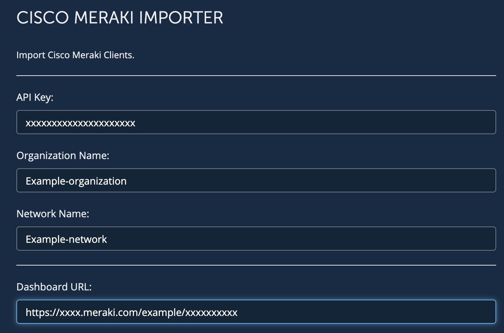
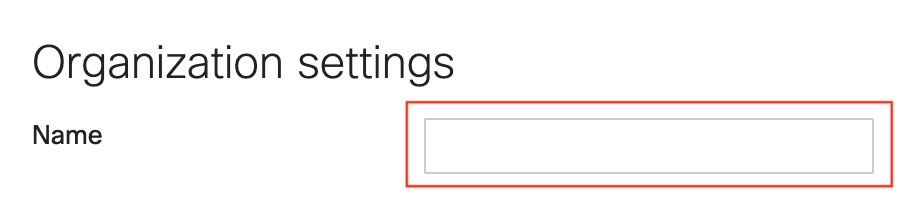
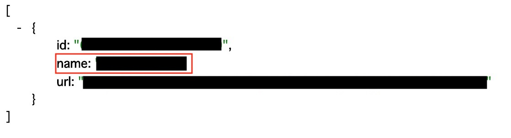
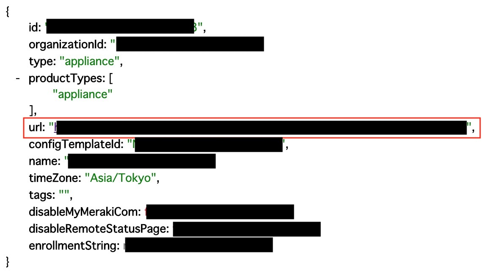
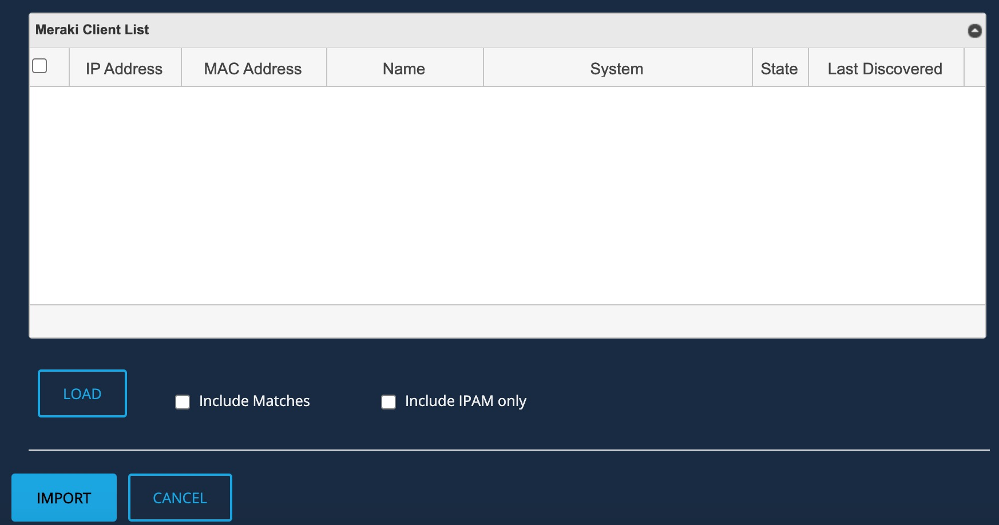
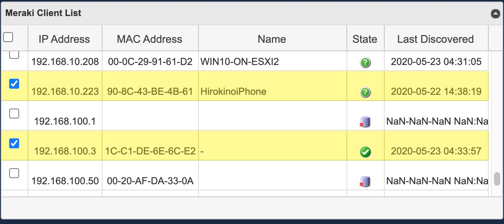
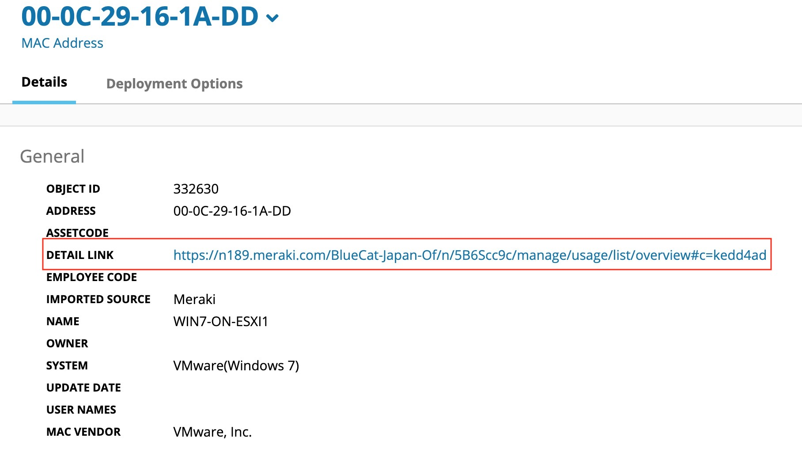
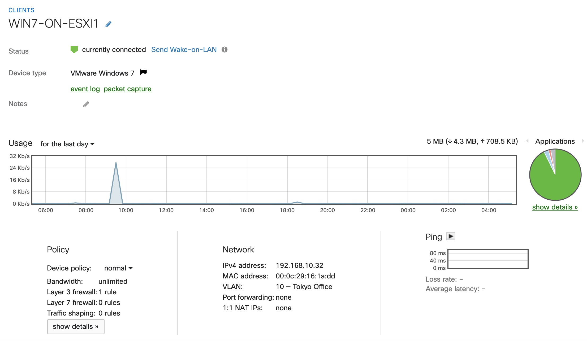

<!--  Copyright 2020 BlueCat Networks (USA) Inc. and its affiliates
 -*- coding: utf-8 -*-

 Licensed under the Apache License, Version 2.0 (the "License");
 you may not use this file except in compliance with the License.
 You may obtain a copy of the License at

 http://www.apache.org/licenses/LICENSE-2.0

Unless required by applicable law or agreed to in writing, software
 distributed under the License is distributed on an "AS IS" BASIS,
 WITHOUT WARRANTIES OR CONDITIONS OF ANY KIND, either express or implied.
 See the License for the specific language governing permissions and
 limitations under the License.

 By: Akira Goto (agoto@bluecatnetworks.com)
 Date: 2020-03-31
 Gateway Version: 20.1.1
 Description: Meraki Importer README.md -->  

# Meraki Importer  
**Bluecat Gateway Version:** v20.1.1 and greater  
**BlueCat Address Manager Version:** v9.1 and greater  

This workflow will import the client device information stored in the Meraki Dashboard into BlueCat Address Manager.  
When import is executed, BlueCat Address Manager will perform IP address reconciliation depending on what is imported.  


## Prerequisites  
1. **BAM Default Configuration**  
This workflow will be using the default configuration value in `/portal/bluecat_portal/config.py` in BlueCat Gateway container.  To set the default configuration, in BlueCat Gateway, go to Administration > Configurations > General Configuration.  
In General Configuration, select the BAM Settings tab and enter the configuration name under "Default Configuration:" and save.  


2. **Additional Python Code**  
This workflow requires addtional python code.  
Copy directory *"sdwan"* under `additional/` to `/portal/bluecat_portal/customizations/integrations/` inside the BlueCat Gateway container.  

3. **jqGrid**  
This workflow requires jqGrid.  
Download jqGrid from [HERE](http://www.trirand.com/blog/?page_id=6).  
After downloading, extract the following two files: *"ui.jqgrid.css"* and *"jquery.jqGrid.min.js"*.  
Copy the two files to `/portal/static/js/vendor/jqgrid/` inside the Bluecat Gateway container.  
Make a new director `jqgrid` under `/portal/static/js/vendor/` if none exists.  


## Usage   
1. **Setting Meraki Importer Parameters**  
Set the following parameters.  
    

- API Key:  
This will be the API key for a specific user to login to the Meraki Dashboard via API.  
Make sure that API access is enabled in the Meraki Dashboard web UI and a key is generated before setting this parameter.  
    
    

- Organization Name:  
This corresponds to the *Organization* name in the **Organization settings** menu.  
Make sure it is the same name (case sensitive) as in the Meraki Dashboard web UI. (*Organization* -> *Settings*)  
    
  You can also obtain this via API.  
  Enter the following into your browser search bar:  
  *https://{Dashboard-Instance}/api/v0/organizations/*  
  Replace {Dashboard-Instance} with your Meraki Dashboard instance (xxx.meraki.com).  
     

- Network Name:  
This corresponds to the *NETWORK* name in the Meraki Dashboard web UI.  
Make sure it is the same name (case sensitive) as in the Meraki Dashboard web UI.  
    
  You can also obtain this via API.  
  Enter the following into your browser search bar:  
  *https://{Dashboard-Instance}/api/v0/organizations/{Organization-ID}/networks*  
  Replace {Dashboard-Instance} with your Meraki Dashboard instance (xxx.meraki.com) and {Organization-ID} with your organization ID.  
    

- Dashboard URL:  
Enter the Meraki Dashboard URL the following format:
*https://{Dashboard-Instance}.meraki.com/{Network-Name}/n/{ID}*
Replace {Dashboard-Instance}, {Network-Name} and {ID}.  

  If you are unsure, you can obtain this via API.  
  Enter the following into your browser search bar:  
  *https://{Dashboard-Instance}/api/v0/organizations/{Organization-ID}/networks/{Network-ID}*   
  Replace {Dashboard-Instance} with your Meraki Dashboard instance (xxx.meraki.com), {Organization-ID} with your organization ID and {Network-ID} with your network ID.  
    


2. **Loading Meraki Client Lists**  
    
  By clicking the *"LOAD"* button, client information stored in Meraki Dashboard will be loaded to the list.  
  By default, only the clients which **DO NOT MATCH** will be loaded to the list.  
  **DO NOT MATCH** means that there is either a *"mismatched IP address"* or an *"unknown IP address"* between the information stored in Meraki Dashboard and the information stored in BlueCat Address Manager.  

+ *"Mismatched IP address"* => An IP address that exists in both BlueCat Address Manager and in Meraki Dashboard, but where the MAC address does not match.  

+ *"Unknown IP address"* => An IP address that exists in Meraki Dashboard, but not in BlueCat Address Manager. This likely represents an address that has been added to the network since the last discovery.  

**Loading Options**  
There are two loading options which you can toggle on or off when loading. Default is toggled off.  
- Include Matches  
When this option is toggled on, it will load the clients which **MATCH**, meaning IP addresses that exists in both BlueCat Address Manager and in Meraki Dashboard where the MAC address match as well.  

- Include IPAM only  
When this option is toggled on, it will load the clients which only exists in BlueCat Address Manager. These clients will be listed as a *reclaimable IP address*.  

    + *"Reclaimable IP Address"* => An IP address that exists in BlueCat Address Manager, but not in Meraki Dashboard. This may represent a device that was turned off at the time of the discovery, or the address may no longer exist on the network.

**Meraki Client List**    
     

- IP Address  
The IP Address of the loaded client.  

- MAC Address  
The MAC Address of the loaded client.  

- Name  
The host name of the loaded client (if exists).  

- State  
The IP address state of the loaded client.  
  + This icon  represents the state **Matched**. When a client of this state is imported, it will not update the IP address and MAC address information in BlueCat Address Manager (since it is already a match) but will add additional information obtained by Meraki Dashboard.  

  + This icon  represents the state **Mismatched**. When a client of this state is imported, it will update the MAC address information in BlueCat Address Manager and add additional information obtained by Meraki Dashboard.  

  + This icon  represents the state **Unknown**. When a client of this state is imported, it will update both IP address and MAC address information in BlueCat Address Manager and add additional information obtained by Meraki Dashboard.  

  + This icon  represents the state **Reclaimable**. When a client of this state is imported, it will reclaim the IP address in BlueCat Address Manager.  

- Last Discovered  
Timestamp of the last time Meraki discovered the client. Meraki Dashboard will only retain this information up to 30 days. If a clients last discovered time is over 30 days plus the clients IP address is registered in BlueCat Address Manager, then the state of the client will appear as **Reclaimable** in the list.  
**IMPORTANT:**  
Before reclaiming an IP address, please bear in mind that there is a good possibility that the last discovered time has expired (gone over 30 days) but the IP address is actually still assigned and thus should not be reclaimed.    

3. **Importing**  
After thoroughly checking the state of the loaded clients, select the clients you wish to import by checking on the checkbox. You can either check them one by one or check all them by checking the top left check box in the list.  
    
  
  Click *IMPORT* to import data into BlueCat Address Manager.  
  By Clicking *CANCEL*, the whole list will be cleared.  

4. **Checking imported information**  
Once imported, check the device information in BlueCat Address Manager.  
  
In addition to the added information from Meraki Dashboard, a direct link to the Meraki Dashboard client information page will appear.  
  

---

## Additional   

1. **Language**  
You can switch to a Japanese menu by doing the following.  
    1. Create *ja.txt* in the BlueCat Gateway container.  
    ```
    cd /portal/Administration/create_workflow/text/  
    cp en.txt ja.txt  
    ```  
    2. In the BlueCat Gateway Web UI, go to Administration > Configurations > General Configuration.   
    In General Configuration, select the *Customization* tab.  
    Under *Language:* type in `ja` and save.  
      

2. **Appearance**  
This will make the base html menus a little bit wider.  
    1. Copy all files under the directory `additional/templates` to `/portal/templates` inside the Bluecat Gateway container.


## Author   
- Akira Goto (agoto@bluecatnetworks.com)  
- Ryu Tamura (rtamura@bluecatnetworks.com)  

## License
©2020 BlueCat Networks (USA) Inc. and its affiliates (collectively ‘ BlueCat’). All rights reserved. This document contains BlueCat confidential and proprietary information and is intended only for the person(s) to whom it is transmitted. Any reproduction of this document, in whole or in part, without the prior written consent of BlueCat is prohibited.
