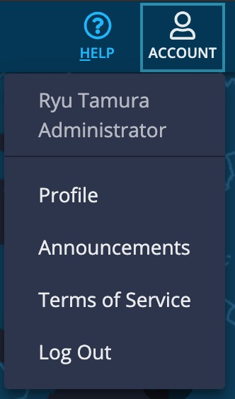
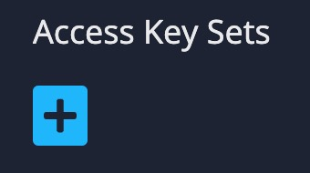
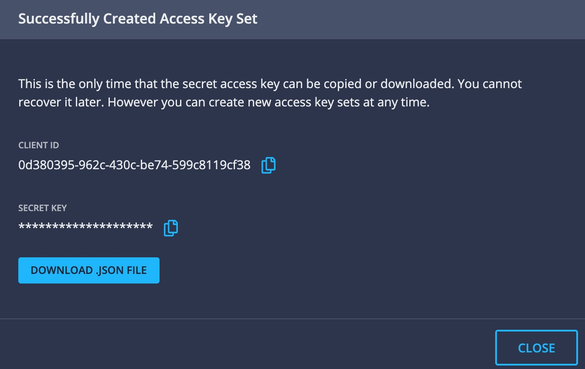

<!--  Copyright 2021 BlueCat Networks (USA) Inc. and its affiliates
 -*- coding: utf-8 -*-

 Licensed under the Apache License, Version 2.0 (the "License");
 you may not use this file except in compliance with the License.
 You may obtain a copy of the License at

 http://www.apache.org/licenses/LICENSE-2.0

Unless required by applicable law or agreed to in writing, software
 distributed under the License is distributed on an "AS IS" BASIS,
 WITHOUT WARRANTIES OR CONDITIONS OF ANY KIND, either express or implied.
 See the License for the specific language governing permissions and
 limitations under the License.

 By: Akira Goto (agoto@bluecatnetworks.com)
 Date: 2019-08-28
 Gateway Version: 19.5.1
 Description: SDWAN Firewall Rule Updater README.md -->  

# SDWAN (Meraki) Firewall Rule Updater  
**Bluecat Gateway Version:** v18.10.2 and greater  
**BlueCat DNS Edge Version:** v2019.8 and greater  

This workflow will update the firewall rule on a SDWAN (Meraki) cloud controller based on BlueCat DNS Edge domain lists.  
The updated rule based on the domain lists will be allowed traffic through the firewall.  
This workflow assumes there is a *"Deny All Traffic"* rule at the end in order for only the firewall rules based on DNS Edge domain lists are allowed through.    

  

## Changes in this release  
1. Supports the updated method for obtaining API access token from DNS Edge v2019.8.  


## Prerequisites  
1. **Additional Python3 Library**  
This workflow requires the python3 *"apscheduler"* library.  
Install the library using PIP3 inside the BlueCat Gateway container.
```
$pip3 install apscheduler

```  

2. **Additional Python Code**  
This workflow requires addtional python code.  
Copy directories *"dnsedge"* and *"sdwan"* under `additional/` to `/portal/bluecat_portal/customizations/integrations/` inside the BlueCat Gateway container.  

3. **jqGrid**  
This workflow requires jqGrid.  
Download jqGrid from [HERE](http://www.trirand.com/blog/?page_id=6).  
After downloading, extract the following two files: *"ui.jqgrid.css"* and *"jquery.jqGrid.min.js"*.  
Copy the two files to `/portal/static/js/vendor/jqgrid/` inside the Bluecat Gateway container.  
Create a *"jqgrid"* directory if it does not exist.  

4. **DNS Edge CI Access Key Sets**  
This workflow requires the DNS Edge CI access key sets JSON file.  
Log in to the DNS Edge Customer Instance via browser.  
Click "Profile" at the top right corner under  "ACCOUNT".  
       


      After opening the Profile page, click the blue cross to create new access key sets.  
         


      Click *DOWNLOAD .JSON FILE* and save the JSON file to a directory of your choosing.  
           


## Usage   

1. **Set DNS Edge Parameters**  
   

Select the *DNS Edge* tab and set the following parameters:  
- DNS Edge URL:  
This URL will be the BlueCat DNS Edge CI.  
The URL should be in the following format:  
*"https://api-<Your_Edge_CI_URL>"*  

- Access Key File (JSON):  
Click `Choose File` and open the DNS Edge Access Key Sets JSON file which contains *Client ID* and *Client Secret*.  
Once the JSON file is chosen, *Client Id:* and *Client Secret:* will be automatically populated.  

Click *"SAVE"*   

2. **Set Meraki Cloud Controller Parameters**  
   

Select the *SDWAN* tab and set the following parameters:  
- API Key:  
This will be the API key for a specific user to login to the Meraki cloud controller via API.  
Make sure that API access is enabled in the Meraki cloud controller web UI and a key is generated before setting this parameter.  

  
  

- Organization Name:  
This corresponds to the *NETWORK* name in the Meraki cloud controller web UI.  
Make sure it is the same name (case sensitive) as in the web UI.  

  

- Template Name:  
This corresponds to the *TEMPLATES* name in the Meraki cloud controller web UI.  
Make sure it is the same name (case sensitive) as in the web UI.  

  

- Rule Delimiter Keyword(phrase):  
The updated firewall rules will be set above this keyword (phrase), meaning any rule below this keyword will not be overwritten.  
Typically a *"Deny All Traffic"* rule will be set here so that only the updated firewall rules based on DNS Edge domain lists will be allowed through.  

  

Click *"SAVE"*   

3. **Set Domain Lists**  
  

Select the *Domain Lists* tab and set the following parameters:  
- Domain List Name  
Type in a domain list to be allowed through the firewall.  
Make sure that the specified domain list is preregistered in DNS Edge CI.  

- Ports  
Type in the port number to be allowed through the firewall.  
Multiple ports can be specified with a comma, or type in *"Any"* for all ports.  

- Protocol  
Choose a protocol to be allowed through the firewall from the dropdown menu.  

Click *"ADD"* to add a domain list or *"DELETE"* to delete a domain list from the table.  

- FQDN check box  
By default, the SDWAN (Meraki) Firewall Rule Updater will update all domains with a prefix asterisk wildcard followed by a dot.   
For example by default, a domain `bc.acme.com` in a domain list will be updated as `*.bc.acme.com` in the firewall rule.   
If you do not wish to add the prefix in the firewall rule, check the FQDN check box.   

Click *"SAVE"*  

4. **Set Polling Intervals**  
  

Select the *Execution* tab and set polling intervals.  
- Interval (sec):  
Specify polling intervals.  

Click *"SYNCHRONIZE NOW"* to synchronize and activate updater.  
If you wish to manually synchronize once without continuous intervals, type in *"0"* in the interval menu and click *"SYNCHRONIZE NOW"*.  
By clicking *"CLEAR"* the settings will be cleared.  


---

## Additional   

1. **Language**  
You can switch to a Japanese menu by doing the following.  
    1. Create *ja.txt* in the BlueCat Gateway container.  
    ```
    cd /portal/Administration/create_workflow/text/  
    cp en.txt ja.txt  
    ```  
    2. In the BlueCat Gateway Web UI, go to Administration > Configurations > General Configuration.   
    In General Configuration, select the *Customization* tab.  
    Under *Language:* type in `ja` and save.  
      

2. **Appearance**  
This will make the base html menus a little bit wider.  
    1. Copy all files under the directory `additional/templates` to `/portal/templates` inside the Bluecat Gateway container.


## Author   
- Akira Goto (agoto@bluecatnetworks.com)  
- Ryu Tamura (rtamura@bluecatnetworks.com)  

## License
©2021 BlueCat Networks (USA) Inc. and its affiliates (collectively ‘ BlueCat’). All rights reserved. This document contains BlueCat confidential and proprietary information and is intended only for the person(s) to whom it is transmitted. Any reproduction of this document, in whole or in part, without the prior written consent of BlueCat is prohibited.
