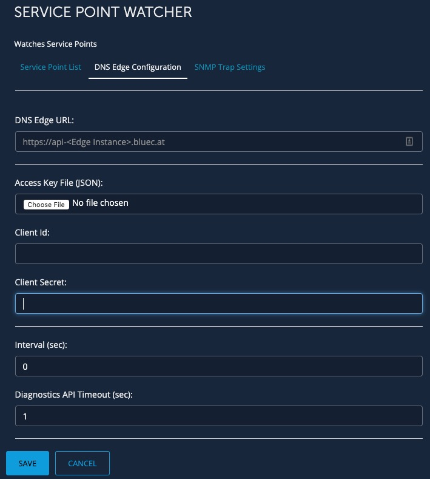
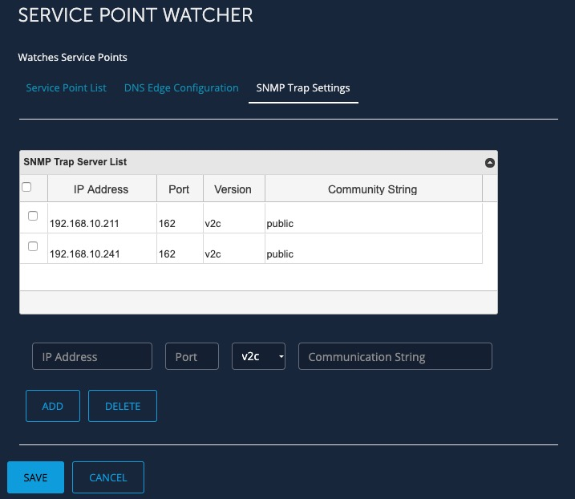
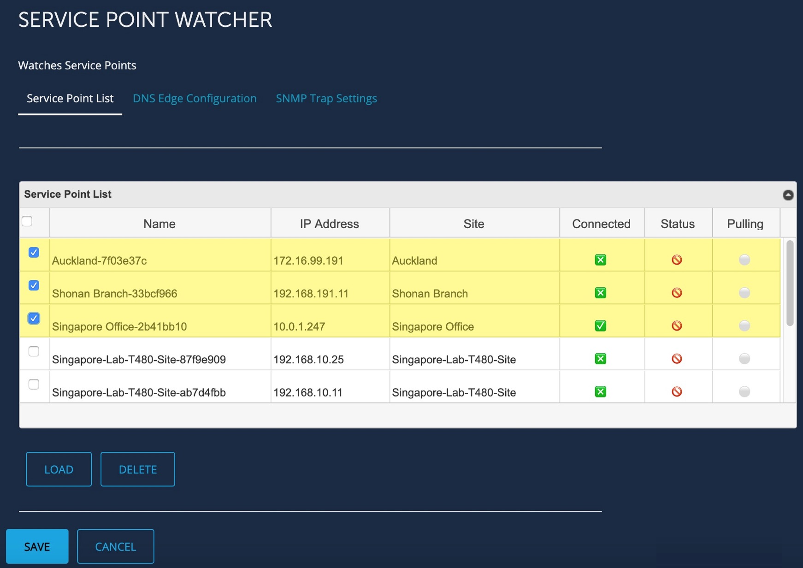
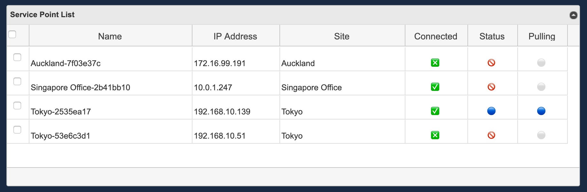

<!--  Copyright 2020 BlueCat Networks (USA) Inc. and its affiliates
 -*- coding: utf-8 -*-

 Licensed under the Apache License, Version 2.0 (the "License");
 you may not use this file except in compliance with the License.
 You may obtain a copy of the License at

 http://www.apache.org/licenses/LICENSE-2.0

Unless required by applicable law or agreed to in writing, software
 distributed under the License is distributed on an "AS IS" BASIS,
 WITHOUT WARRANTIES OR CONDITIONS OF ANY KIND, either express or implied.
 See the License for the specific language governing permissions and
 limitations under the License.

 -Original creation info-
 By: Akira Goto (agoto@bluecatnetworks.com)
 Date: 2019-08-28
 Gateway Version: 19.5.1

 -Update info-
 By: Akira Goto (agoto@bluecatnetworks.com)
 Date: 2020-04-30
 Gateway Version: 20.3.1
 Description: Service Point Watcher README.md -->  

# Service Point Watcher  
**Bluecat Gateway Version:** v18.10.2 and greater  
**BlueCat DNS Edge Version:** v2019.8 and greater  

This workflow will monitor the DNS Edge Service Points which belong to a specified Customer Instance (CI).  
It will only list Service Points which are associated with an IP address.  

## Changes in this release  
1. Added toggle on / off checkbox for each Service Point in the Service Point List.
2. Changed icon for the state of Service Points in the Service Point List.

## Architecture  
The following diagram depicts the architecture:  
  
1. Service Point Watcher will acquire the service point information from the Customer Instance and determine which service point to monitor.  

2. Based on the information from 1, Service Point Watcher will periodically call the service point diagnostic API to the selected service points and monitor and display the overall status of the service point plus each service status within the service point.  

3. Any change in status will be notified via SNMP trap.

## Prerequisites  
1. **Additional Python3 Library**  
This workflow requires the python3 *apscheduler* and *pysnmp* library.  
Install the library using PIP3 inside the BlueCat Gateway container.
```
$pip3 install apscheduler
$pip3 install pysnmp

```  

2. **Additional Python Code**  
This workflow requires addtional python code.  
Copy the directory *"dnsedge"* under `additional/` to `/portal/bluecat_portal/customizations/integrations/` inside the BlueCat Gateway container.  

3. **jqGrid**  
This workflow requires jqGrid.  
Download jqGrid from [HERE](http://www.trirand.com/blog/?page_id=6).  
After downloading, extract the following two files: *"ui.jqgrid.css"* and *"jquery.jqGrid.min.js"*.  
Copy the two files to `/portal/static/js/vendor/jqgrid/` inside the Bluecat Gateway container.  
Create a *"jqgrid"* directory if it does not exist.   

4. **DNS Edge CI Access Key Sets**  
This workflow requires the DNS Edge CI access key sets JSON file.  
Log in to the DNS Edge Customer Instance via browser.  
Click "Profile" at the top right corner under  "ACCOUNT".  
       


      After opening the Profile page, click the blue cross to create new access key sets.  
         


      Click *DOWNLOAD .JSON FILE* and save the JSON file to a directory of your choosing.  
           


## Usage   
1. **Set DNS Edge Configurations**  
   

Click the *DNS Edge Configuration* tab and set the following parameters.  
- DNS Edge URL:  
This URL will be the BlueCat DNS Edge CI.  
The URL should be in the following format:  
*"https://api-<Your_Edge_CI_URL>"*  

- Access Key File (JSON):  
Click `Choose File` and open the DNS Edge Access Key Sets JSON file which contains *Client ID* and *Client Secret*.  
Once the JSON file is chosen, *Client Id:* and *Client Secret:* will be automatically populated.  

- Interval (sec):  
This will set the polling interval to the Service Points. The unit is seconds.  
If you do not wish to activate Service Point Watcher, specify the interval to *"0"*.  

- Diagnostic API Timeout (sec):  
This will set the diagnostic API call timeout to each of the Service Points that will be monitored.  
The unit is seconds.  

Click *"SAVE"* to save settings.  

2. **SNMP Trap Settings**  
  

Click the *SNMP Trap Settings* tab and set the following parameters for SNMP traps.  
- IP Address:  
Type in the IP Address of the SNMP trap server you wish to send the SNMP traps to.  

- Port:  
Type in the port number you wish to send the SNMP traps through. This is typically set to `162`.  

- SNMP Version:  
Select either `v1` or `v2c` from the drop down menu. (v3 is currently not supported)  

- Community String  
Type in the community string of the SNMP trap.  

Click *"ADD"*  
A configured SNMP server should appear in the *SNMP Trap Server List* table above.  
If you need to add more than one server, repeat the process above.  
If you need to delete a server, click on the check box of each server on the *SNMP Trap Server List* table and click *"DELETE"*.  

Click *"SAVE"* to save settings.  

3. **Service Point List**  
   

Click the *Service Point List* tab to select the Service Points to be monitored.  

Click *"LOAD"* to load all the Service Points which are under the specified Customer Instance (CI).  
This will take some time to load depending on the number of Service Points managed by the specified CI.  
After loading is complete, all Service Points should appear in the *Service Point List* table.  

Select the Service Points you **DO NOT** wish to monitor by checking on the check box of each Service Point on the *Service Point List* table and click *"DELETE"*.  
Check that only the Service Points you wish to monitor are remaining in the table.  

Click *"SAVE"* to save settings.  

Once saved, Service Point Watcher will activate and will start to poll to the service points according to the polling intervals.  
If you wish to deactivate Service Point Watcher, specify the interval to *"0"* and save in the *DNS Edge Configuration* tab.   
Service points which are **NOT** associated with an IP address will not be listed even if it belongs to the specified CI.  

Information on each column are the following.  
   

- Watch  
Toggle on / off which Service Points to monitor.  
Toggled off Service Points will not be monitored.
Check / Uncheck the box to do so.  
Click *"SAVE"* to save settings.  

- Name  
The name of the service point.  
It is typically a unique name followed by the first eight digits of the Service Point ID.   

- IP Address  
The IP address of the Service Point.  

- Site  
The site which the Service Point belongs to within the specified CI.  

- Connected  
This shows the connectivity of the Service Point to the CI.  
A green check mark  will be shown if the service point is connected to the CI.  
A green question mark  will be shown if the service point is not connected to the CI.  

- Status  
This shows the status and the reachability of the service point from the Service Point Watcher.  
The status is based on the service point diagnostic API.  
A green circle  will be shown when the status of the Service Point is *GOOD* and is reachable from the Service Point Watcher.  
A red blinking circle  will be shown when the status of the Service Point is *BAD* but is reachable from the Service Point Watcher.  
A red circle with a line  will be shown if the service point is unreachable from the Service Point Watcher.  

- Pulling  
This shows whether the Service Point is successfully pulling information from the CI.  
It is monitoring the timestamp of the polling service and the status will change depending on length of the time.  
A green circle  will be shown as **GOOD** when the polling service is polling in a timely manner.    
A yellow circle  will be shown as **WARNING** when the polling service has not polled for more than 15 minutes.  
A red blinking circle  will be shown as **CRITICAL** when the polling service has not polled for more than 60 minutes.  
A white circle  will be shown as **UNKNOWN** when the *Status* of the Service Point is *Unreachable* (  ). This indicates that since the Service Point is unreachable from the Service Point Watcher, Service Point Watcher will not be able to ascertain whether the Service Point is successfully pullling information from the CI, hence unknown.

4. **SNMP Traps**  
The following are the list of SNMP traps used in Service Point Watcher.  
These traps are defined in the following MIB files, *BCN-SP-MON-MIB.mib*, *BCN-TC-MIB.mib* and *BCN-SMI-MIB.mib*.  
All three MIB files are located under `additional/mib`.  
All MIB OID has a prefix of `1.3.6.1.4.1.13315`.
  

- bcnSpMonAlarmServiceStatus  
Service Point Watcher will issue `bcnSpMonAlarmServiceStatus` whenever there is a change in status of the Service Point itself or the services within the Service Point.  
    - Parameters  
    bcnSpMonAlarmHostInfo：OctetString(‘Service Point name')  
    bcnSpMonAlarmServiceInfo：OctetString(‘Service names’)  
    bcnSpMonAlarmServiceState：OctetString(‘Status’)

- bcnSpMonAlarmSettingsPollingHasStopped  
Service Point Watcher will issue `bcnSpMonAlarmSettingsPollingHasStopped` depending on the change of last polling timestamp time.  
    - Parameters  
    bcnSpMonAlarmHostInfo：OctetString(‘Service Point name’)  
    bcnSpMonAlarmCond：OctetString(‘Conditition of the alarm’)  
    bcnSpMonAlarmSeverity：Integer(Normal(20)|Warning(40)|Critical(60))  
    bcnSpMonLastPollingTimestamp：OctetString(‘Last polling timestamp’)  
      

5. **Service Point Diagnostic API**  
  

If a Service Point is reachable from the Service Point Watcher, then a Service Point diagnostic API can be called by clicking the *"Name"* of the service point in the *Service Point List* table.  


---

## Additional   

1. **Language**  
You can switch to a Japanese menu by doing the following.  
    1. Create *ja.txt* in the BlueCat Gateway container.  
    ```
    cd /portal/Administration/create_workflow/text/  
    cp en.txt ja.txt  
    ```  
    2. In the BlueCat Gateway Web UI, go to Administration > Configurations > General Configuration.   
    In General Configuration, select the *Customization* tab.  
    Under *Language:* type in `ja` and save.  
      

2. **Appearance**  
This will make the base html menus a little bit wider.  
    1. Copy all files under the directory `additional/templates` to `/portal/templates` inside the Bluecat Gateway container.


## Author   
- Akira Goto (agoto@bluecatnetworks.com)  
- Ryu Tamura (rtamura@bluecatnetworks.com)   

## License
©2020 BlueCat Networks (USA) Inc. and its affiliates (collectively ‘ BlueCat’). All rights reserved. This document contains BlueCat confidential and proprietary information and is intended only for the person(s) to whom it is transmitted. Any reproduction of this document, in whole or in part, without the prior written consent of BlueCat is prohibited.
