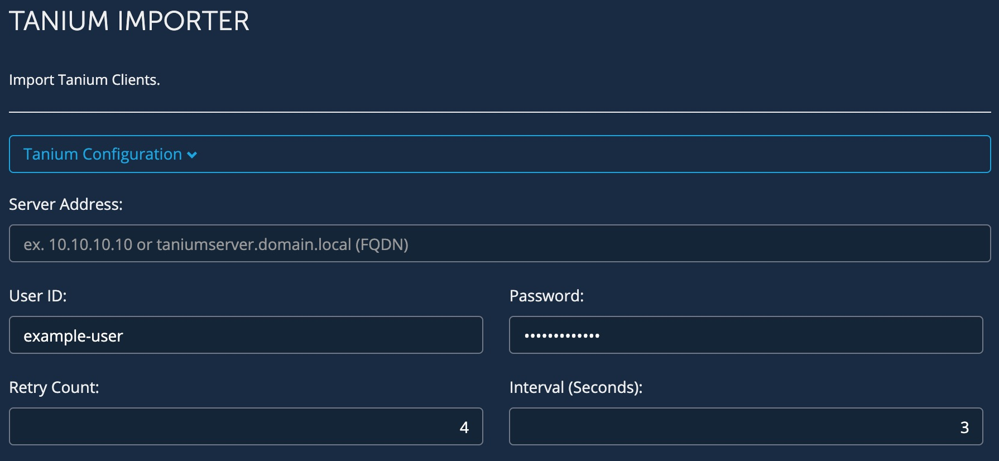
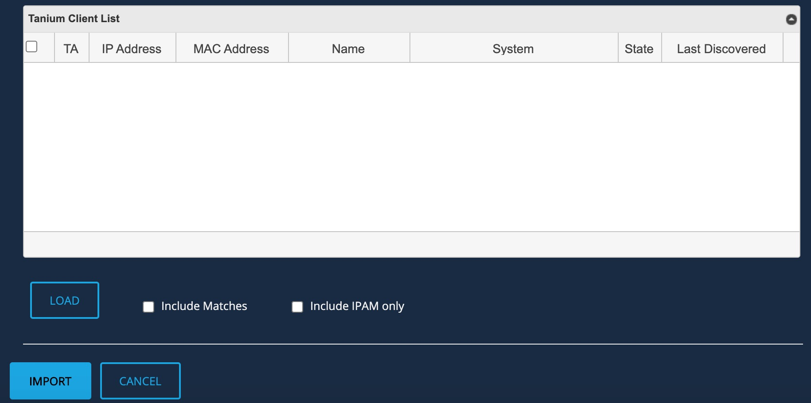
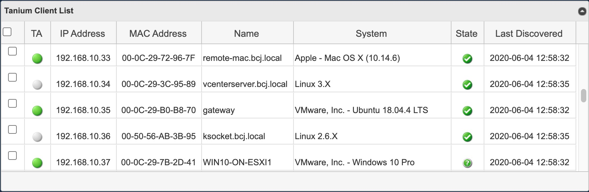
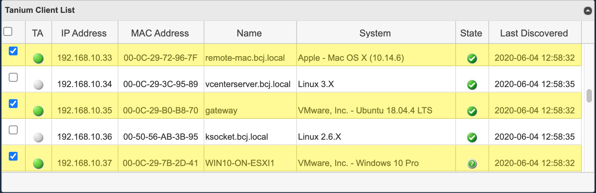

<!--  Copyright 2020 BlueCat Networks (USA) Inc. and its affiliates
 -*- coding: utf-8 -*-

 Licensed under the Apache License, Version 2.0 (the "License");
 you may not use this file except in compliance with the License.
 You may obtain a copy of the License at

 http://www.apache.org/licenses/LICENSE-2.0

Unless required by applicable law or agreed to in writing, software
 distributed under the License is distributed on an "AS IS" BASIS,
 WITHOUT WARRANTIES OR CONDITIONS OF ANY KIND, either express or implied.
 See the License for the specific language governing permissions and
 limitations under the License.

 By: Akira Goto (agoto@bluecatnetworks.com)
 Date: 2020-05-31
 Gateway Version: 20.3.1
 Description: Tanium Importer README.md -->  

# Tanium Importer  
**Bluecat Gateway Version:** v20.3.1 and greater  
**BlueCat Address Manager Version:** v9.1 and greater  

This workflow will import the client device information stored in the Tanium Dashboard into BlueCat Address Manager.  
When import is executed, BlueCat Address Manager will perform IP address reconciliation depending on what is imported.  


## Prerequisites  
1. **BAM Default Configuration**  
This workflow will be using the default configuration value in `/portal/bluecat_portal/config.py` in BlueCat Gateway container.  To set the default configuration, in BlueCat Gateway, go to Administration > Configurations > General Configuration.  
In General Configuration, select the BAM Settings tab and enter the configuration name under "Default Configuration:" and save.  

      


2. **Additional Python Code**  
This workflow requires addtional python code.  
Copy directory *"tanium"* under `additional/` to `/portal/bluecat_portal/customizations/integrations/` inside the BlueCat Gateway container.  

3. **jqGrid**  
This workflow requires jqGrid.  
Download jqGrid from [HERE](http://www.trirand.com/blog/?page_id=6).  
After downloading, extract the following three files: *"ui.jqgrid.css"*, *"jquery.jqGrid.min.js"* and *"grid.locale-xx.js"*.  
*"grid.locale-xx.js"* will change depending on the locale you choose to use.  
(For instance, for Japan it will be *"grid.locale-ja.js"*)  
Copy the three files to `/portal/static/js/vendor/jqgrid/` inside the Bluecat Gateway container.  
Make a new director `jqgrid` under `/portal/static/js/vendor/` if none exists.  

4. **UDF**  
This workflow requires additional UDF to the **MAC Address object** in BAM.  
Add the following UDF to the **MAC Address object** in BAM.  
  - System  
  Field Name: System    
  Display Name: System   
  Type: Text  
  - Imported Source    
  Field Name: ImportedSource  
  Display Name: Imported Source   
  Type: Text  


## Usage   
1. **Setting Tanium Importer Parameters**  
Click the *"Tanium Configuration"* pull down menu to open up parameter settings.  
Set the following parameters.    

      


- Server Address:  
The Tanium server IP address or the FQDN of the Tanium server.  

- User ID:  
A username which is registered in the Tanium Dashboard.    

- Password:  
The corresponding password for the username entered above.     

**Retry count and Intervals**  
Whenever loading Tanium clients via API, the Tanium server will fetch to each endpoint and acquire the latest information. This takes time and therefore loading all Tanium clients might take more than one API call.   
The retry counts and the intervals make it possible for the importer to retry the API call until it acquires the necessary  client information.  

- Retry Count:  
The number of retries for the API call.  
The default and recommended value is **4**.

- Interval (Seconds):  
The number of seconds between retries.  
The default and recommended value is **3**.  

2. **Setting Target Networks**  
Set the network(s) of the Tanium clients you wish to acquire with CIDR notation.  

      

    Muliple networks can be targeted with a comma separator.  
    (e.g. `192.168.10.0/24, 10.10.10.0/24`)  

    **"Include Discovered" Loading Option**  
    By toggling on this option, when loading, it will also load the clients which **DO NOT** have Tanium Agents installed.  
    This is possible because of the *"Discover"* function of Tanium.  
    Default is toggled off (meaning it will only load clients with Tanium Agents installed).  


3. **Loading Tanium Client Lists**  

      

    By clicking the *"LOAD"* button, client information stored in Tanium Dashboard will be loaded to the list.  
    By default, only the clients which **DO NOT MATCH** will be loaded to the list.  
    **DO NOT MATCH** means that there is either a *"mismatched IP address"* or an *"unknown IP address"* between the information stored in Tanium Dashboard and the information stored in BlueCat Address Manager.  

+ *"Mismatched IP address"* => An IP address that exists in both BlueCat Address Manager and in Tanium Dashboard, but where the MAC address does not match.  

+ *"Unknown IP address"* => An IP address that exists in Tanium Dashboard, but not in BlueCat Address Manager. This likely represents an address that has been added to the network since the last discovery.  

**Loading Options**  
There are two loading options which you can toggle on or off when loading. Default is toggled off.  
- Include Matches  
When this option is toggled on, it will additionally load the clients which **MATCH**, meaning IP addresses that exists in both BlueCat Address Manager and in Tanium Dashboard where the MAC address match as well.  

- Include IPAM only  
When this option is toggled on, it will load the clients which only exists in BlueCat Address Manager. These clients will be listed as a *"reclaimable IP address"*.  

    + *"Reclaimable IP Address"* => An IP address that exists in BlueCat Address Manager, but not in Tanium Dashboard. This may represent a device that was turned off at the time of the discovery, or the address may no longer exist on the network.

**Tanium Client List**    
     

- TA  
Indicates whether a *"Tanium Agent"* is installed.  
  + This icon  will show when a *"Tanium Agent"* is installed in the client.    

  + This icon  will show when a *"Tanium Agent"* is not installed in the client. These clients will only appear when the *"Include Discovered"* loading option is toggled on.  

- IP Address  
The IP Address of the loaded client.  

- MAC Address  
The MAC Address of the loaded client.  

- Name  
The computer name of the loaded client (if exists).  

- System  
The operating system of the loaded client (if exists).  

- State  
The IP address state of the loaded client.  
  + This icon  represents the state **Matched**. When a client of this state is imported, it will not update the IP address and MAC address information in BlueCat Address Manager (since it is already a match) but will add additional information obtained by Tanium Dashboard.  

  + This icon  represents the state **Mismatched**. When a client of this state is imported, it will update the MAC address information in BlueCat Address Manager and add additional information obtained by Tanium Dashboard.  

  + This icon  represents the state **Unknown**. When a client of this state is imported, it will update both IP address and MAC address information in BlueCat Address Manager and add additional information obtained by Tanium Dashboard.  

  + This icon  represents the state **Reclaimable**. When a client of this state is imported, it will reclaim the IP address in BlueCat Address Manager.  

- Last Discovered  
Timestamp of the last time Mist discovered the client. Tanium Dashboard will only retain this information up to 30 days. If a clients last discovered time is over 30 days plus the clients IP address is registered in BlueCat Address Manager, then the state of the client will appear as **Reclaimable** in the list.  
**IMPORTANT:**  
Before reclaiming an IP address, please bear in mind that there is a good possibility that the last discovered time has expired (gone over 30 days) but the IP address is actually still assigned and thus should not be reclaimed.    

3. **Importing**  
After thoroughly checking the state of the loaded clients, select the clients you wish to import by checking on the checkbox. You can either check them one by one or check all them by checking the top left check box in the list.  

      


    Click *IMPORT* to import data into BlueCat Address Manager.  
    By Clicking *CANCEL*, the whole list will be cleared.  

    **DHCP leased IP addresses**  
    If the imported IP address happens to be a DHCP leased IP address, then it will **NOT** update the IP address and MAC address information in BlueCat Address Manager and will only add additional information obtained by Meraki Dashboard.  

4. **Checking imported information**  
Once imported, check the device information in BlueCat Address Manager.  

      


---

## Additional   

1. **Language**  
You can switch to a Japanese menu by doing the following.  
    1. Create *ja.txt* in the BlueCat Gateway container.  
    ```
    cd /portal/Administration/create_workflow/text/  
    cp en.txt ja.txt  
    ```  
    2. In the BlueCat Gateway Web UI, go to Administration > Configurations > General Configuration.   
    In General Configuration, select the *Customization* tab.  
    Under *Language:* type in `ja` and save.  

            


2. **Appearance**  
This will make the base html menus a little bit wider.  
    1. Copy all files under the directory `additional/templates` to `/portal/templates` inside the Bluecat Gateway container.


## Author   
- Akira Goto (agoto@bluecatnetworks.com)  
- Ryu Tamura (rtamura@bluecatnetworks.com)  

## License
©2020 BlueCat Networks (USA) Inc. and its affiliates (collectively ‘ BlueCat’). All rights reserved. This document contains BlueCat confidential and proprietary information and is intended only for the person(s) to whom it is transmitted. Any reproduction of this document, in whole or in part, without the prior written consent of BlueCat is prohibited.
