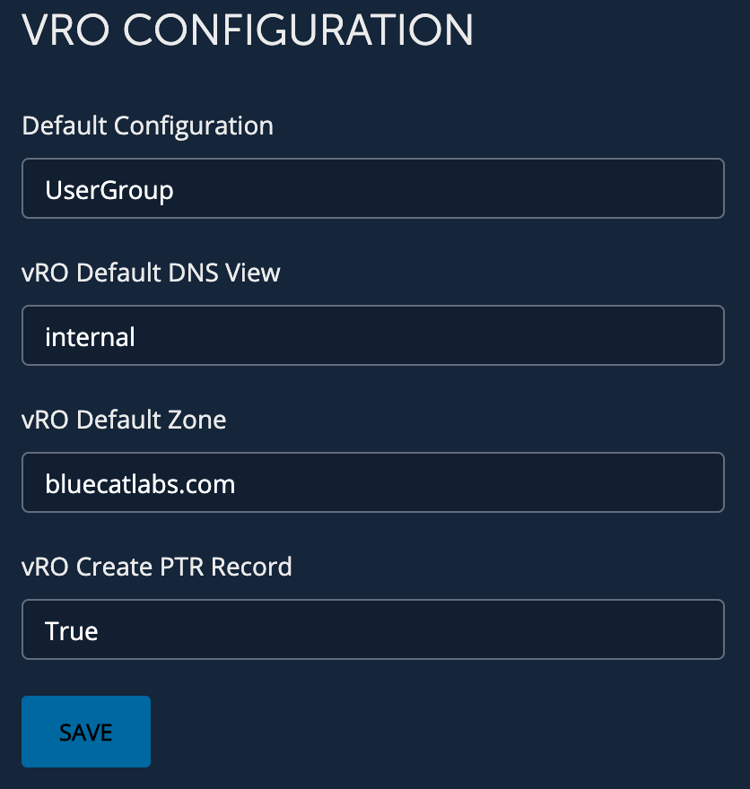

# **Community: vRO Provision Server Configuration - User Group 2019**
This workflow is used to configure values used in vRO Provision Server workflow.

___

### Requirements
**BlueCat Gateway version:** 19.8.1 and greater  
**Address Manager version:** v9.0.0 or greater  
**Address Manager:**  Configuration of the Gateway server IP address in the BAM Administration Console. For more information, refer to the section Adding host access to the database in the Address Manager Administration Guide  

___

### Description/Example Usage
This workflow allows you to configure the vRO Provision Server workflow. 

___

### Workflow Configuration

1.  Navigate to the workflow vRO > vRO Configuration and configure:
    * **Default Configuration** - Configuration used for getting networks, IP Addresses and creating the hostname
    * **Default View** - The View that is in the above Configuration
    * **vRO Default Zone** - The Zones to create the hostname in
    * **vRO Create PTR Record** -  True/False - Should a reverse record be created

  

___

<!--
### Youtube Tutorial

-->

___

### Known Errors and Bugs: 

None

___

©2020 BlueCat Networks (USA) Inc. and its affiliates (collectively ‘ BlueCat’). All rights reserved.
This document contains BlueCat confidential and proprietary information and is intended only for the person(s) to whom it is transmitted.
Any reproduction of this document, in whole or in part, without the prior written consent of BlueCat is prohibited.
