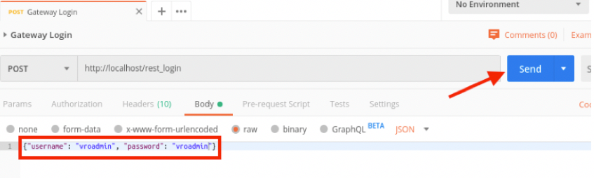
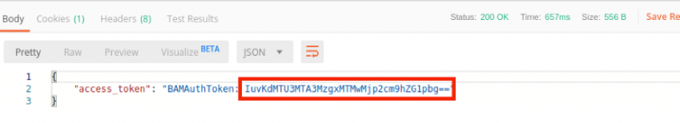
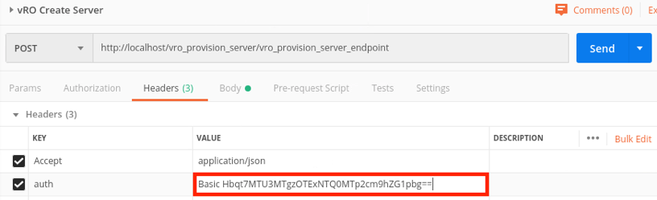
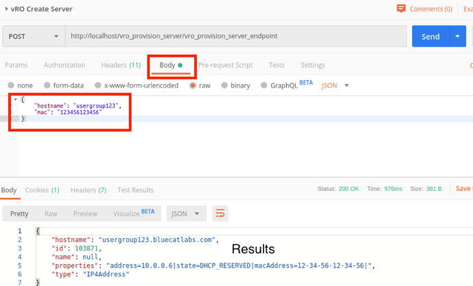

# **Community: vRO Provision Server - User Group 2019**
This workflow is used for vRO Provisioning Server.

___

### Requirements
**BlueCat Gateway version:** 19.8.1 and greater  
**Address Manager version:** v9.0.0 or greater  
**Address Manager:**  Configuration of the Gateway server IP address in the BAM Administration Console. For more information, refer to the section Adding host access to the database in the Address Manager Administration Guide  

___

### Description/Example Usage
A REST endpoint that can be used in vRO to create a server.  

___

### Workflow Configuration

1.  Create the following in Address Manager:
    * **Tag Group > vRO Configuration** - This is the base tag group. 
    * **Tag > vRO Networks** - This is the tag used to get the networks
    * **Tag Networks** - The networks used to get next available IP

 

  

___

### Postman Usage

1. To get your Gateway Token:

 

  

Note:
•	Username and Password in this example is vroadmin/vroadmin
•	The returned value is the token which we need to copy and use it in the next step

 

  

2. vRO request to execute the vRO Create Server. Copy and paste the token value into the Header > Auth value section

 

  

3. Click on the Body tab and enter the following data. After complete, click Send:
•	Hostname: “usergroup123”
•	Mac: “123456123456”

 

  

___

### Known Errors and Bugs: 

None
___

©2020 BlueCat Networks (USA) Inc. and its affiliates (collectively ‘ BlueCat’). All rights reserved.
This document contains BlueCat confidential and proprietary information and is intended only for the person(s) to whom it is transmitted.
Any reproduction of this document, in whole or in part, without the prior written consent of BlueCat is prohibited.
