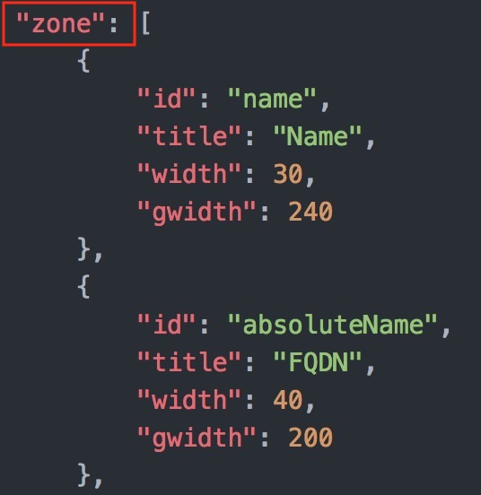
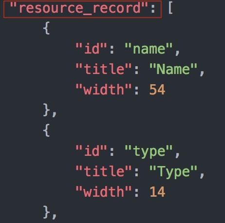

# Zone Exporter  
**Bluecat Gateway Version:** 18.10.2 and greater  
**BAM Version:** 9.0.0 and greater  

This workflow will list and export existing views / zones / resource records.   

## Prerequisites
1. **BAM Default Configuration**  
This workflow will be using the default configuration value in `/portal/bluecat_portal/config.py` in BlueCat Gateway container.  To set the default configuration, in BlueCat Gateway, go to Administration > Configurations > General Configuration.  
In General Configuration, select the BAM Settings tab and enter the configuration name under "Default Configuration:" and save.  
  

2. **Python3 openpyxl library**  
This workflow requires the python3 openpyxl library.  
Install openpyxl library using PIP3 inside the BlueCat Gateway container.
```
$pip3 install openpyxl

```  

3. **jqGrid**  
This workflow requires jqGrid in the html templates as shown below:  
  
  

    Download jqGrid from [HERE](http://www.trirand.com/blog/?page_id=6).  
    After downloading, extract the following two files: *"ui.jqgrid.css"* and *"jquery.jqGrid.min.js"*.  
    Copy the two files to `/portal/static/js/vendor/jqgrid/` inside the Bluecat Gateway container.  


## Usage   

1. **Expand tree view**  
Expand tree view and inspect data.  
Existing view / zone information will be shown here.
  

2. **Specify view or zone and export**  
Specify a view or a zone.  
Choose format:  *Excel* or *CSV*.  
Choose contents: *Zone Structure*, *Resource Records* or *Structure and Records*.   
Click *DOWNLOAD*  
  

3. **Exported file**  
Open the exported file.  
Check that the specified view / zone data has been exported.  
  

      Click a zone or switch through worksheets to see each resource record data.  
        

---

## Additional  

1. **Adding additional UDF columns**  
      If you wish to add more UDF columns to the table, you can do so by editing the *config_en.json* file.  
      The *zone* section corresponds to blocks and networks.  
              

      *id* corresponds to the Field Name of the Zone object.  
            *title* corresponds to name of the column.  
            *width* corresponds to the width of the column when exported to a spreadsheet.  
            *gwidth* corresponds to the width of the column shown on the BlueCat Gateway web UI.  

      Add the above at the end of the *zone* section for each column.  
            For example,  

        ```
        {
            "id": "zonetest",  
            "title": "zone_test",  
            "width": 20,  
            "gwidth": 200  
        },  
        ```  

The *resource_record* section corresponds to resource records.  
           

*id* corresponds to the Field Name of the Resource Record object.  
            *title* corresponds to the title of the column.  
            *width* corresponds to the width of the column when exported to a spreadsheet.  

Add the above at the end of the *zone* section for each column.  
For example,  


        ```
        {
            "id": "rrtest",
            "title": "rr_test",
            "width": 20  
        },
        ```

Make sure the corresponding UDFs exist on BAM prior to adding additional columns.  
      Edit the *config_ja.json* file for Japanese.  


2. **Language**  
You can switch to a Japanese menu by doing the following.  
    1. Create *ja.txt* in the BlueCat Gateway container.  
    ```
    cd /portal/Administration/create_workflow/text/  
    cp en.txt ja.txt  
    ```  
    2. In the BlueCat Gateway Web UI, go to Administration > Configurations > General Configuration.   
    In General Configuration, select the *Customization* tab.  
    Under *Language:* type in `ja` and save.  
      

3. **Appearance**  
This will make the base html menus a little bit wider.  
    1. Copy all files under the directory `additional/templates` to `/portal/templates` inside the Bluecat Gateway container.

## Author   
- Akira Goto (agoto@bluecatnetworks.com)  
- Ryu Tamura (rtamura@bluecatnetworks.com)   

## License
©2020 BlueCat Networks (USA) Inc. and its affiliates (collectively ‘ BlueCat’). All rights reserved. This document contains BlueCat confidential and proprietary information and is intended only for the person(s) to whom it is transmitted. Any reproduction of this document, in whole or in part, without the prior written consent of BlueCat is prohibited.
