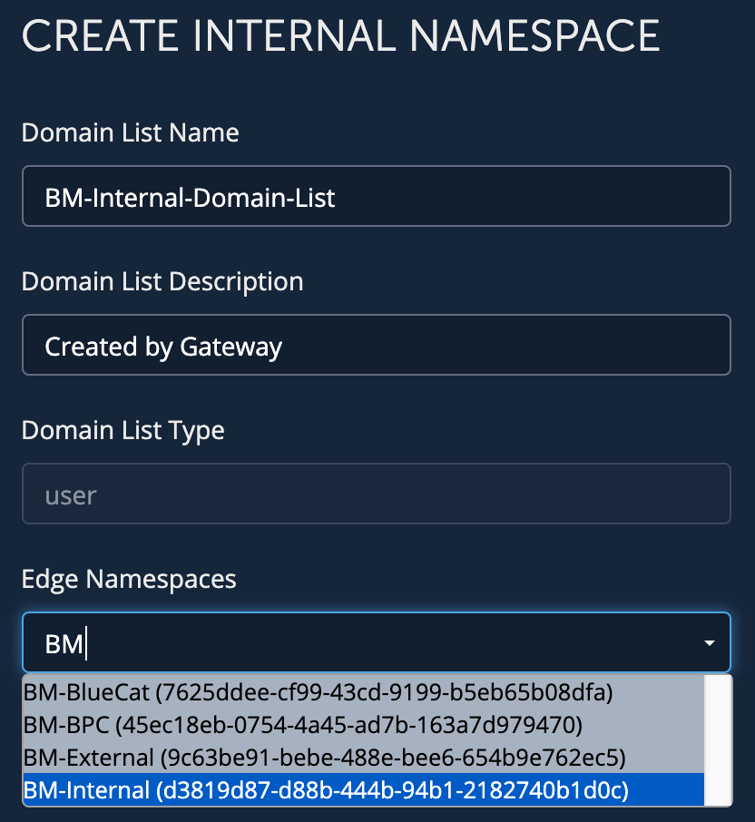

# **Edge: Create Internal Namespace/Domain List**
This workflow will create a Domain List and add all your deployable zones in the view you selected. If you choose to select a Namespace, it will attached the created Domain List to the existing Namespace.
___

### Requirements
**BlueCat Gateway version:** 19.8.1 and greater  
**Address Manager version:** v9.0.0 or greater  
**Address Manager:**  Configuration of the Gateway server IP address in the BAM Administration Console. For more information, refer to the section Adding host access to the database in the Address Manager Administration Guide  

___

### Description/Example Usage

When creating a new Domain List, we will grab all deployable zones and subzones in the view that is configured. If you dont populate the Namespace field, this will only create a Domain List with the attached zones.

Below is an example of creating a new Domain List and adding it to an existing Namespace:

 

  

 

___

### Prerequisites

1. Copy the edge.py file from Edge > customizations to your local Gateway 

2. Generate your Edge ClientID and Client Secret

3. Install the configuration workflow (Edge > Edge Internal Namespace > edge_create_internal_ns_config)

___

### Known Errors and Bugs: 

1)  None

___

©2020 BlueCat Networks (USA) Inc. and its affiliates (collectively ‘ BlueCat’). All rights reserved.
This document contains BlueCat confidential and proprietary information and is intended only for the person(s) to whom it is transmitted.
Any reproduction of this