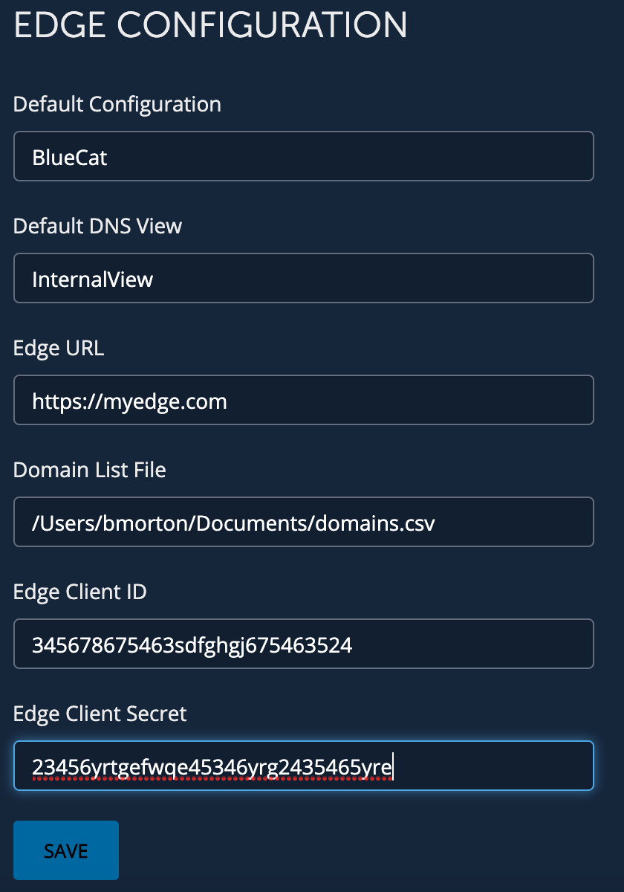

# **Edge: Configure Internal Namespace Workflow**
This workflow is used to configure values used in Create Internal Namespace workflow.

___

### Requirements
**BlueCat Gateway version:** 19.8.1 and greater  
**Address Manager version:** v9.0.0 or greater  
**Address Manager:**  Configuration of the Gateway server IP address in the BAM Administration Console. For more information, refer to the section Adding host access to the database in the Address Manager Administration Guide  

___

### Description/Example Usage
This Edge workflow allows you to configure the Create Internal Namespace workflow. 

___

### Workflow Configuration

1.  Navigate to the workflow ServiceNow CMDB > CMDB Configuration and configure:
    * **Default Configuration** - Configuration that the View and Zones are in 
    * **Default View** - The View that is in the above Configuration and the internal zones you want to add to the Domain List/Namespace
    * **Edge URL** - Your Edge URL
    * **Domain List File** -  This is a file that used to populate all the zones/subzones
    * **Client Id** - Please refer to the Edge documentation for generating your ClientID
    * **Client Secret** - Please refer to the Edge documentation for generating yourClient Secret

  

___

<!--
### Youtube Tutorial

-->

___

### Known Errors and Bugs: 

1)  If you put workflow's in the folder Admin or Administration, the import/backups will not work properly. Please refrain from using these directories.

___

©2019 BlueCat Networks (USA) Inc. and its affiliates (collectively ‘ BlueCat’). All rights reserved.
This document contains BlueCat confidential and proprietary information and is intended only for the person(s) to whom it is transmitted.
Any reproduction of this document, in whole or in part, without the prior written consent of BlueCat is prohibited.
